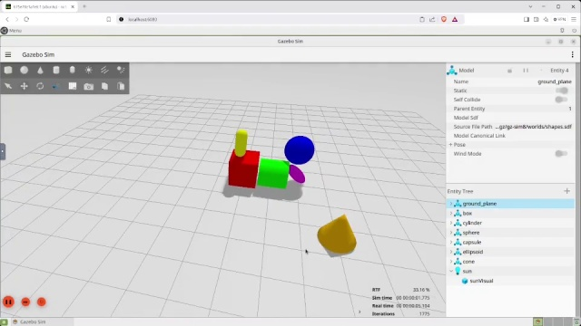
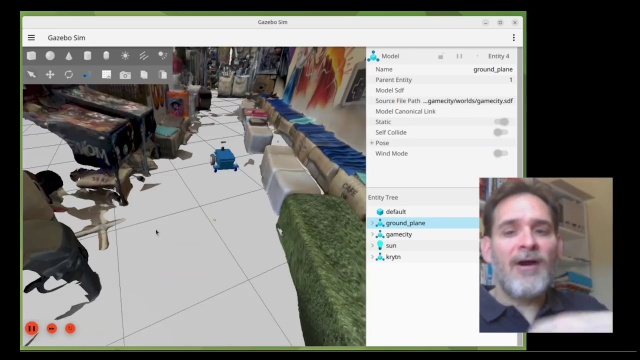

# Become a roboticist challenge

## Intro

This month of February I will be following @JohnVial 's [28-day robotics challenge]( https://becomearoboticist.com/). The program blends ideas from [teaching sprints](https://www.teachingsprints.com/), [atomic habits](https://jamesclear.com/atomic-habits-summary), and the [build in public](https://buildinpublic.com/) manifesto. I will document the process and share daily progress updates and key learnings in this repo as well as this [twitter thread](https://x.com/aergenium/status/1888376092571967708) 

I will be documenting the process in this repo: https://github.com/mhered/RoboticsChallenge 

Learn more about the program here: https://becomearoboticist.com/  

| Video | Day  | Title   | Highlights |
|-------|------|---------|------------|
|  | [Day 0](./Day00/)  | [3 Ways To Get You Computer Setup With Robotics - The easy way, the hard way and the dangerous way](./Day00/README.md) | Setting things up. The [repo]([https://github.com/johnny555/bar_ws](https://t.co/zbIHhpvXrG)) provides a containerized environment super easy to setup. Leveraging WLS, docker and the Dev Containers VS Code extension eliminates the need to fiddle with dual boot, ubuntu or ROS installs version compatibility, or dependencies. |
|  | [Day 1](./Day01/)  | [The Right Way And The Wrong Way To Drive A Robot](./Day01/README.md) | Started off easy with some simple teleop in simulation. Two highlights: first, I loved the 3D-scanned real scene in Gazebo, way more immersive than your usual turtlebot tutorial. Second, I finally got the chance to test OBS Studio for video production. Check the video! |
|  | [Day 1_Bonus](./Day01_Bonus/)  | [3D-Scanning And Importing Real Scenes Into Gazebo](./Day01_Bonus/README.md) | I got trapped in this rabbit hole: scanning a real scene with Scaniverse, repairing the mesh in Blender and Instant Meshes, making a simplified Collision model in FreeCAD and importing it all into Gazebo |
|  | [Day 2](./Day02/)  | [How Robotic Systems Communicate And How You Can Listen](./Day02/README.md) |  |
|  | [Day 3](./Day03/)  | [Robot Eyes Why You Need To See Through Them](./Day03/README.md) | [@JohnVial](https://x.com/JohnVial) |
|  | [Day 4](./Day04/)  | [Don't Let Your Robot Become Lost - How To Give It A Map](./Day04/README.md) |  |
|  | [Day 5](./Day05/)  | [Self Driving Robot? How To Make A Robot Autonomous](./Day05/README.md) |  |
|  | [Day 6](./Day06/)  | [How To Control An Autonomous Robot With Code Instead of A GUI](./Day06/README.md) |  |
|  | [Day 7](./Day07/)  | [How To Use CAD To Create Custom Robot Links](./Day07/README.md) |  |
|  | [Day 8](./Day08/)  | [How To Add Your Custom Link To Your Robot](./Day08/README.md) |  |
|  | [Day 9](./Day09/)  | [3 Steps To Finding Problems To Solve With Wheeled Robots & How To Choose When You Have Too Many](./Day09/README.md) |  |
|  | [Day 10](./Day10/)  | [How To Control A Robot Arm - The Easy Way](./Day10/README.md) |  |
|  | [Day 11](./Day11/)  | [7 Useful Commands That Will Let You Interrogate Any ROS 2 System](./Day11/README.md) |  |
|  | [Day 12](./Day12/)  | [3 Steps To Designing A Simple Gripper In CAD](./Day12/README.md) |  |
|  | [Day 13](./Day13/)  | [How To Install A Gripper On Your Robot Arm In Simulation](./Day13/README.md) |  |
|  | [Day 14](./Day14/)  | [How To Setup The ROS2 Standard For Joint Control And How To Control Joints With Code](./Day14/README.md) |  |
|  | [Day 15](./Day15/)  | [The Easy Way To Setup Your Robot Arm - Configuring MoveIT 2](./Day15/README.md) |  |
|  | [Day 16](./Day16/)  | [How To Control A Full Robot Arm With Code](./Day16/README.md) |  |
|  | [Day 17](./Day17/)  | [How To Create A Gazebo World - Adding Something To Pickup](./Day17/README.md) |  |
|  | [Day 18](./Day18/)  | [How To Stop Your Robot Arm From Hitting Things - Adding Collision Avoidance Sensors To Your Robot Arm](./Day18/README.md) |  |
|  | [Day 19](./Day19/)  | [How To Find Problems That Robot Arms Can Solve And How To Choose One](./Day19/README.md) |  |
|  | [Day 20](./Day20/)  | [A Starter Template For Designing Wheel Robots In CAD For ROS](./Day20/README.md) |  |
|  | [Day 21](./Day21/)  | [3 Things To Consider When Choosing Your Robot Project](./Day21/README.md) |  |
|  | [Day 22](./Day22/)  | [How To Use Photos To Quickly Create Realistic Robot Models In CAD](./Day22/README.md) |  |
|  | [Day 23](./Day23/)  | [Exporting Your Robot From FreeCAD And Configuring ROS 2 Control So You Can Teleoperate It](./Day23/README.md) |  |
|  | [Day 24](./Day24/)  | [3 Tips To Create a compelling an environment for your robot](./Day24/README.md) |  |
|  | [Day 25](./Day25/)  | [2 Important Sensors To Consider Adding To Your Robot](./Day25/README.md) |  |
|  | [Day 26](./Day26/)  | [How To Iterate On A Robot Simulation To Make It More Realistic](./Day26/README.md) |  |
|  | [Day 27](./Day27/)  | [How To Configure Mapping & Navigation So Your Custom Robot Can Drive Itself](./Day27/README.md) |  |
|  | [Day 28](./Day28/)  | [How To Control Your Custom Robot With Code To Make It Really Autonomous](./Day28/README.md) |  |

