# Become a roboticist challenge

## Intro

This month I am following [Dr John Vial](https://x.com/johnvial) 's [28-day robotics challenge]( https://becomearoboticist.com/). 

The program blends ideas from [teaching sprints](https://www.teachingsprints.com/), [atomic habits](https://jamesclear.com/atomic-habits-summary), and the [build in public](https://buildinpublic.com/) manifesto. 

I will document the process and share daily progress updates and key learnings in this repo as well as this [twitter thread](https://x.com/aergenium/status/1888376092571967708) 

Check out also my notes on the [Live Sessions](Live_Sessions.md)

## To Do

- [ ]  investigate the `/slam_toolbox` node using `ros2 note info /slam_toolbox` and see what it is publishing. Maybe there is something you can use there?
- [ ] fork, symlink or copy `bar_ws` to commit changes
- [ ] move large files (currently inside `raw_video` folders) somewhere where they will be backed up e.g. in Dropbox 

## The Challenge

| Video | Day  | Title   | Highlights |
|-------|------|---------|------------|
| [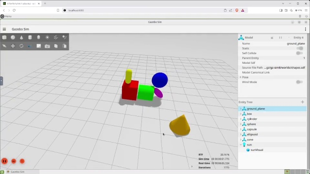](./notes/Day00/assets/Day00.mp4) | [Day 0](./notes/Day00/) | [3 Ways To Get You Computer Setup With Robotics - The easy way, the hard way and the dangerous way](./notes/Day00/README.md) | Setting things up. The [repo]([https://github.com/johnny555/bar_ws](https://t.co/zbIHhpvXrG)) provides a containerized environment super easy to setup. Leveraging WLS, docker and the Dev Containers VS Code extension eliminates the need to fiddle with dual boot, ubuntu or ROS installs version compatibility, or dependencies. |
| [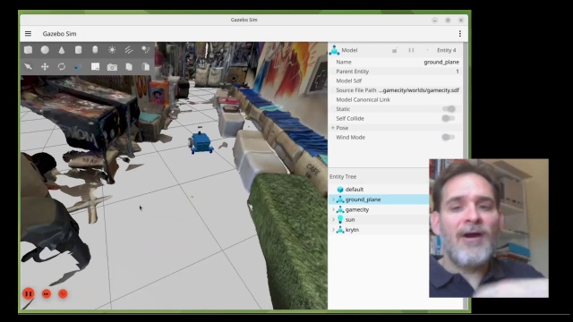](./notes/Day01/assets/Day01.mp4) | [Day 1](./notes/Day01/) | [The Right Way And The Wrong Way To Drive A Robot](./notes/Day01/README.md) | Day 1 started off easy with some simple teleop in simulation. Two highlights: first, I loved the 3D-scanned real scene in Gazebo, way more immersive than your usual turtlebot tutorial. Second, I finally got the chance to test OBS Studio for video production. Check the video! |
|  | [Day 1_Bonus](./notes/Day01_Bonus/) | [3D-Scanning And Importing Real Scenes Into Gazebo](./notes/Day01_Bonus/README.md) | I got trapped in this rabbit hole: scanning a real scene with [Scaniverse](https://scaniverse.com/), repairing the mesh in Blender and [Instant Meshes](https://github.com/wjakob/instant-meshes), making a simplified collision model in FreeCAD and importing it all into Gazebo |
|  | [Day 2](./notes/Day02/) | [How Robotic Systems Communicate And How You Can Listen](./notes/Day02/README.md) | Day 2 brushes up on basic ros2 CLI commands which came actually handy as I spent ages troubleshooting pesky issues that prevented running the Krytn teleop. In the end it had probably been me clumsily touching things from inside and outside the container who caused the problem in the first place. In the meantime, the "Hard way" (running ubuntu "baremetal", no containers) is still not working for me. |
| [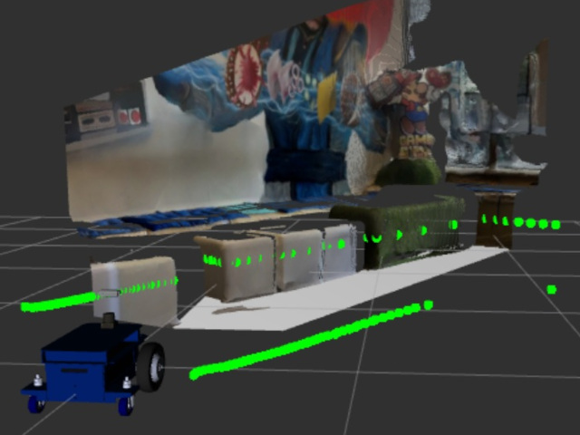](./notes/Day03/assets/Day03.mp4) | [Day 3](./notes/Day03/) | [Robot Eyes Why You Need To See Through Them](./notes/Day03/README.md) | Day 3: looking through the eyes of the robot |
| [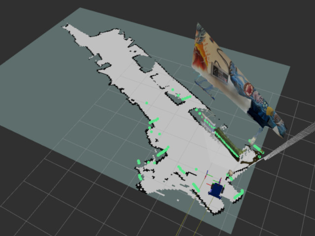](./notes/Day04/assets/Day04.mp4) | [Day 4](./notes/Day04/) | [Don't Let Your Robot Become Lost - How To Give It A Map](./notes/Day04/README.md) | Day 4: mapping Game City café and exploring the contents of the launch files. I am now working bare metal in ubuntu 24.04, and it makes a difference: gazebo, rviz visualizations run smooth! |
| [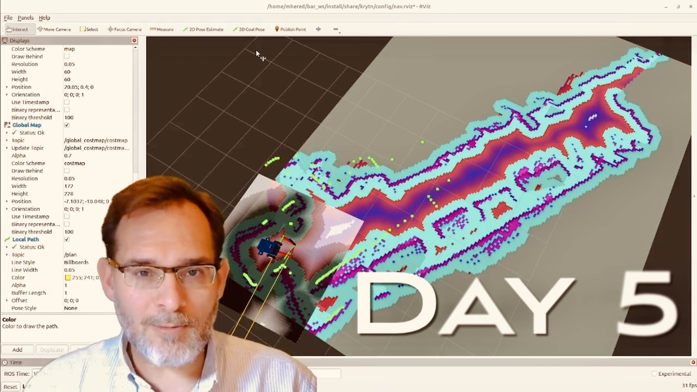](./notes/Day05/assets/Day05.mp4) | [Day 5](./notes/Day05/) | [Self Driving Robot? How To Make A Robot Autonomous](./notes/Day05/README.md) | Day 5: ROS2 package Nav2 enables autonomous navigation. Under the hood, a global planner calculates the best route to the goal using a static global costmap, and a local planner constantly scans for obstacles near the robot in a local costmap, and updates the path to avoid surprises. |
| [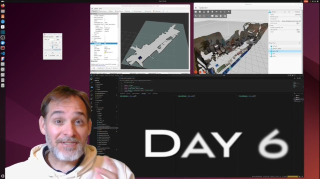](./notes/Day06/assets/Day06_final.mp4) | [Day 6](./notes/Day06/) | [How To Control An Autonomous Robot With Code Instead Of A GUI](./notes/Day06/README.md) | Day 6 - we wrote a ROS2 Python node to publish directly to `/goal_pose` instead of manually clicking to choose a destination. Useful e.g. for docking the robot, although in practice it'll need much more refinement - actions, waypoints, sensors etc. Started to explore waypoints but had to move on. |
| 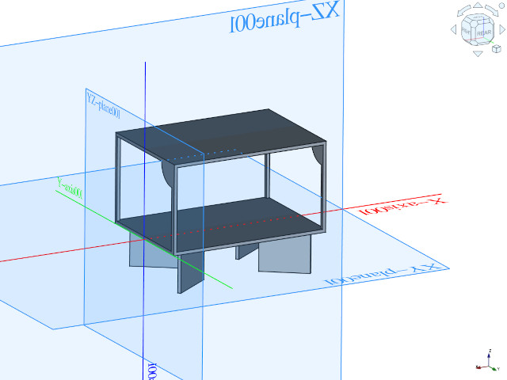 | [Day 7](./notes/Day07/) | [How To Use CAD To Create Custom Robot Links](./notes/Day07/README.md) | Day 7 - sketching a simple accessory for the robot in FreeCAD. The course touches on sketching over images/drawings, thinking pads and pockets, and keeping the model simple. From experience, I would add: using repositories of 3D models for components such as GrabCAD, and exporting the simplified model to STL. |
| [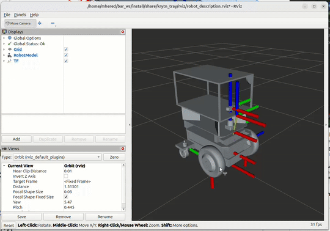](./notes/Day08/assets/Day08.mp4) | [Day 8](./notes/Day08/) | [How To Add Your Custom Link To Your Robot](./notes/Day08/README.md) | Day 8 - I finally could give the CROSS FreeCAD workbench a try today, and I am impressed. Just the GUI interface to determine frame of reference transforms for joints and links and the 1-click export for a full robot description package make it well worth the setup effort. Another highlight was the URDF/xacro walkthrough and troubleshooting tips. Oh, and my Krytn robot is happily driving around with a shiny new tray. |
| [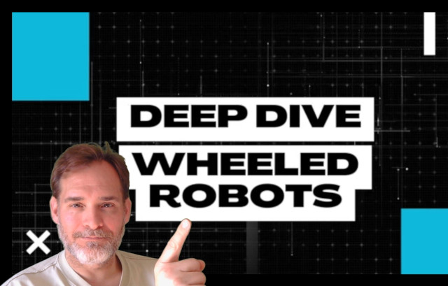](https://youtu.be/tWYqNRaFAnk) | [Day 9](./notes/Day09/) | [3 Steps To Finding Problems To Solve With Wheeled Robots & How To Choose When You Have Too Many](./notes/Day09/README.md) | Day 9 - the task today was to research on configurations and applications of wheeled robots. I got so carried away I ended up making a long(ish)  video and uploaded it to Youtube. |
| [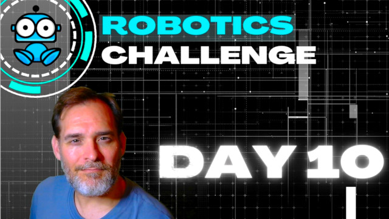](https://youtu.be/J-kMbwL5vv0) | [Day 10](./notes/Day10/) | [How To Control A Robot Arm - The Easy Way](./notes/Day10/README.md) | Day 10 - First contact with MoveIt, the ROS2 package for robotic arms. From simple pick-and-place to advanced manipulation, MoveIt simplifies a lot motion planning and control. Plus, the spawning sequence at launch needs a bit more attention. |
| [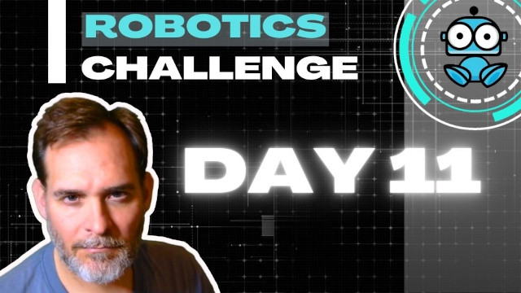](https://www.youtube.com/watch?v=G3HDDM32CW4) | [Day 11](./notes/Day11/) | [7 Useful Commands That Will Let You Interrogate Any ROS 2 System](./notes/Day11/README.md) | Day 11 -Time to take the plunge into the ROS2 CLI. As a bonus, I came across  `ros_network_viz` and gave it a try - way better than the old `rqt_graph` to visually explore a ROS2 system, their elements and interdependencies |
| [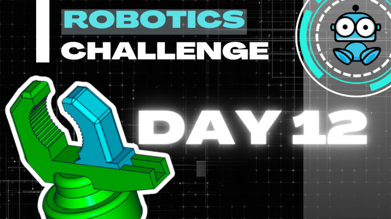](https://youtu.be/0ksRfzYruxs) | [Day 12](./notes/Day12/) | [3 Steps To Designing A Simple Gripper In CAD](./notes/Day12/README.md) | Day12 - making a gripper for the robotic arm using FreeCAD and the CROSS workbench |
| 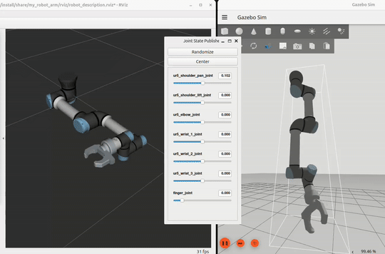 | [Day 13](./notes/Day13/) | [How To Install A Gripper On Your Robot Arm In Simulation](./notes/Day13/README.md) | Day 13 - installing the new gripper on the robotic arm, this time directly editing URDF and XACRO |
| [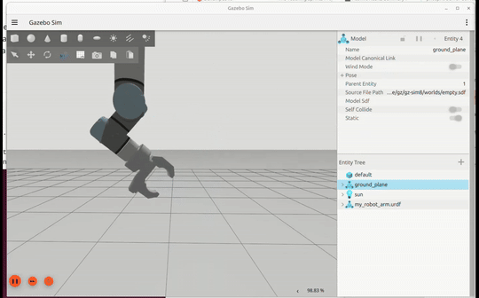](./notes/Day14/assets/Day14.mp4) | [Day 14](./notes/Day14/) | [How To Setup The ROS2 Standard For Joint Control And How To Control Joints With Code](./notes/Day14/README.md) | Day 14 - configuring `ros2_control` for the gripper joint and creating a node that makes it move. Quite involved, and couldn't quite make it work reliably |
|  | [Day 15](./notes/Day15/) | [The Easy Way To Setup Your Robot Arm - Configuring MoveIT 2](./notes/Day15/README.md) | Day 15 - configuring `my_robot_arm` involves defining self-collision, planning groups, named poses, ros2_control and MoveIt controllers, launch files… ROS is very verbose, so this means a zillion lines of python, yaml & urdf. Fortunately the MoveIt wizard guides you step by step and writes all the code for you ready to be integrated in your package. Mind you, there's a fair amount of manual tuning needed and I spent hours troubleshooting obscure error messages. Still worthwhile if we compare this with the effort it took on Day 14 manually configuring a single joint! |
| 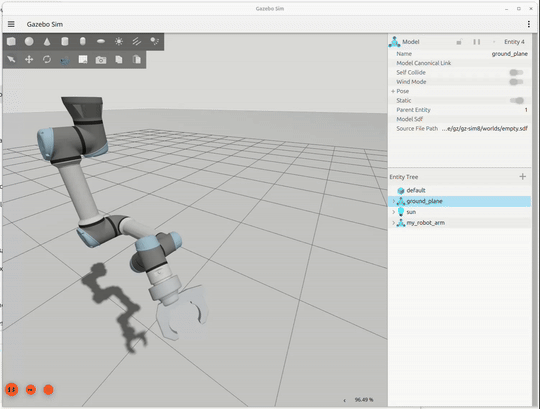 | [Day 16](./notes/Day16/) | [How To Control A Full Robot Arm With Code](./notes/Day16/README.md) | Day 16 - I wrote a ROS2 node in Python to control my arm |
|  | [Day 17](./notes/Day17/) | [How To Create A Gazebo World - Adding Something To Pickup](./notes/Day17/README.md) |  |
|  | [Day 18](./notes/Day18/) | [How To Stop Your Robot Arm From Hitting Things - Adding Collision Avoidance Sensors To Your Robot Arm](./notes/Day18/README.md) |  |
|  | [Day 19](./notes/Day19/) | [How To Find Problems That Robot Arms Can Solve And How To Choose One](./notes/Day19/README.md) |  |
|  | [Day 20](./notes/Day20/) | [A Starter Template For Designing Wheel Robots In CAD For ROS](./notes/Day20/README.md) |  |
|  | [Day 21](./notes/Day21/) | [3 Things To Consider When Choosing Your Robot Project](./notes/Day21/README.md) |  |
|  | [Day 22](./notes/Day22/) | [How To Use Photos To Quickly Create Realistic Robot Models In CAD](./notes/Day22/README.md) |  |
|  | [Day 23](./notes/Day23/) | [Exporting Your Robot From FreeCAD And Configuring ROS 2 Control So You Can Teleoperate It](./notes/Day23/README.md) |  |
|  | [Day 24](./notes/Day24/) | [3 Tips To Create a compelling an environment for your robot](./notes/Day24/README.md) |  |
|  | [Day 25](./notes/Day25/) | [2 Important Sensors To Consider Adding To Your Robot](./notes/Day25/README.md) |  |
|  | [Day 26](./notes/Day26/) | [How To Iterate On A Robot Simulation To Make It More Realistic](./notes/Day26/README.md) |  |
|  | [Day 27](./notes/Day27/) | [How To Configure Mapping & Navigation So Your Custom Robot Can Drive Itself](./notes/Day27/README.md) |  |
|  | [Day 28](./notes/Day28/) | [How To Control Your Custom Robot With Code To Make It Really Autonomous](./notes/Day28/README.md) |  |

