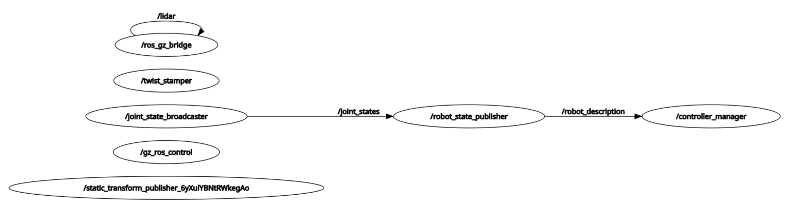

# Become a roboticist challenge

## Intro

This month of February I will be following @JohnVial 's [28-day robotics challenge]( https://becomearoboticist.com/). The program blends ideas from [teaching sprints](https://www.teachingsprints.com/), [atomic habits](https://jamesclear.com/atomic-habits-summary), and the [build in public](https://buildinpublic.com/) manifesto. I will document the process and share daily progress updates and key learnings in this repo as well as this [twitter thread](https://x.com/aergenium/status/1888376092571967708) 

I will be documenting the process in this repo: https://github.com/mhered/RoboticsChallenge 

Learn more about the program here:: https://becomearoboticist.com/  

## Day 0

Day 0: Setting things up. The challenge's repo  provides a containerized environment very easy to setup. Leveraging WLS, docker and the Dev Containers VS Code extension eliminates the need to fiddle with dual boot, ubuntu or ROS installs version compatibility, or dependencies. 

### Sources

[Course](https://course.becomearoboticist.com/)

[Discord channel](https://discord.gg/WpUGZYqXQN)

### First install

1. Download  [Visual Studio Code](https://code.visualstudio.com/Download) and install it
2. Download [Docker Desktop](https://docs.docker.com/desktop/setup/install/windows-install/) and install it - loong!
3. In Power Shell install WSL - long, and seems to require admin permissions:

```shell
> wsl --install
```

4. Restart the PC for changes to take effect

5. Run Docker (status should show: Engine running)

6. Launch an Ubuntu shell, clone the repo and open VS Code inside the folder

```bash
> ubuntu
$ cd ~
$ git clone https://github.com/johnny555/bar_ws.git
$ cd bar_ws
$ code . 
```

7. Install the Dev Containers VS Code extension
8. Open `bar_ws` folder in dev container. Ctrl+Caps + P > **Dev Containers: Open Folder in Container**... The first time it takes a very looong time to set up 20Gb of virtual machine
9. Ctrl+Caps + P > **Run Task** > **Test Gazebo**
10. In browser, open the GUI: `http://localhost:6080/` and play with Gazebo

### Relaunch

Run Docker  (status should show: Engine running)

Launch VS Code inside the `bar_ws` folder. e.g Open terminal typing `wsl` in the Search bar:

```bash
$ cd bar_ws
$ code .
```

**Reopen** the folder in container (or Ctrl+Caps + P > **Dev Containers: Open Folder in Container**... select `/home/mhered/bar_ws`  )

Ctrl+Caps + P > **Run Task** > **Test Gazebo**

In browser, open: `http://localhost:6080/`

Took actually a couple of days, played a bit with OBS Studio and made a video

### Key learnings

* cool Windows setup using Docker and Dev Containers VS Code extension shows promise 
* great excuse for a first contact with OBS Studio 

## Kick Off meeting

Works for Nexus

Krytn & MACI Coffee robot

Read "Atomic Habits" James Clear - sprint to change self perception

"show your work" - a record, as a way to appreciate what we learn and get noticed

tag john vial

roughly 1 hour per day then write and share what I learnt for 28 consecutive days

Days 0-9 - Krytn Coffee Robot - standard ROS navigation stack then extend it using FreeCAD (add a tray)

10-19 MACI robot arm - adding collision avoidance. Controlling a robot arm is complicated. Extend it with our own gripper then pick up a can from a tray

20-28 build your own robot - find something relevant to you and simulate it! Will provide templates.

Additional Bonus videos to extend: real robots, frameworks and templates, AI...

Join Discord!

7 daily tasks each week (do the task and post about it)

Play with github copilot can help get unstuck

Copilot

Pearce - Engineering degree. Did robotics without ROS (was extracurricular). Doing PM in navy

11 pax in the cohort

## Day 1

Easy start, teleop using RQT GUI and `teleop_keyboard`

Key learnings: 

* the idea to scan real life environments using a phone app piqued my interest

## Day 2

* can open a terminal inside the docker either through the GUI with terminator or in vscode dev containers clicking on the `+`icon 
* learnt about vcstool https://github.com/dirk-thomas/vcstool

### Troubleshooting

Krytn teleop task runs but the robot does not move, even though `/cmd_vel` topic has traffic. 

Task throws error "Failed to activate controller":

````bash
[...]
[gazebo-1] [ERROR] [1738886097.960364961] [controller_manager]: Switch controller timed out after 5.000000 seconds!
[spawner-7] [ERROR] [1738886097.962109904] [spawner_joint_state_broadcaster]: Failed to activate controller
[ERROR] [spawner-7]: process has died [pid 4396, exit code 1, cmd '/opt/ros/jazzy/lib/controller_manager/spawner joint_state_broadcaster diff_drive_base_controller --ros-args'].
[...]
````

```bash
$ ros2 doctor
[...]
/opt/ros/jazzy/lib/python3.12/site-packages/ros2doctor/api/topic.py: 42: UserWarning: Publisher without subscriber detected on /diff_drive_base_controller/cmd_vel.
/opt/ros/jazzy/lib/python3.12/site-packages/ros2doctor/api/topic.py: 42: UserWarning: Publisher without subscriber detected on /dynamic_joint_states.
/opt/ros/jazzy/lib/python3.12/site-packages/ros2doctor/api/topic.py: 42: UserWarning: Publisher without subscriber detected on /joint_state_broadcaster/transition_event.
[...]
/opt/ros/jazzy/lib/python3.12/site-packages/ros2doctor/api/topic.py: 42: UserWarning: Publisher without subscriber detected on /tf.
/opt/ros/jazzy/lib/python3.12/site-packages/ros2doctor/api/topic.py: 42: UserWarning: Publisher without subscriber detected on /tf_static.

All 5 checks passed

$ ros2 node list
/controller_manager
/gz_ros_control
/joint_state_broadcaster
/robot_state_publisher
/ros_gz_bridge
/rqt_gui_py_node_4393
/static_transform_publisher_6yXulYBNtRWkegAo
/twist_stamper
$ #/diff_drive_base_controller and one additional /static_trasnform_publisher_XXX are missing!

$ros2 topic list
[...]
$ #/odom missing!
```

```bash
$ ros2 topic echo /cmd_vel
linear:
  x: 0.0
  y: 0.0
  z: 0.0
angular:
  x: 0.0
  y: 0.0
  z: -1.21
---
linear:
  x: 0.0
  y: 0.0
  z: 0.0
angular:
  x: 0.0
  y: 0.0
  z: -1.21
---
[...]
$ ros2 topic info /cmd_vel
Type: geometry_msgs/msg/Twist
Publisher count: 1
Subscription count: 1
$ 
```

`/twist_stamper` subscribes to Twist messages in `/cmd_vel` and translates to TwistStamped messages which it publishes on `/diff_drive_base_controller/TwistStamped`  

```bash
$ros2 interface show geometry_msgs/msg/TwistStamped

```

More intrigued with the docker and devcontainers



## Sources

https://www.linkedin.com/posts/ahcorde_ros-ros2-opensource-activity-7291100454443216897-L__N

Insight - a modern, user-friendly GUI for ROS 2

Current GUI Features

The application already supports several core functionalities for interacting with ROS2:

 \- Viewing Nodes: Display detailed information about running nodes  (similar to ros2 node list and ros2 node info), including their topics,  services, and more.

 \- Viewing Topics: List all topics (similar to ros2 topic list),  inspect details of specific topics (similar to ros2 topic info), and  view message definitions.

 \- Viewing Services: List all services (similar to ros2 service  list), inspect specific services (similar to ros2 service info), and  view message definitions.

 \- Viewing Actions: List all actions (similar to ros2 action list), inspect specific actions, and view message definitions.

 \- Viewing Message Definitions: Access detailed message structures, including raw definitions. This was the first feature developed and the original motivation for creating the GUI.

 \- Viewing Transformations (TFs): Visualize all coordinate frames  and calculate transformations between frames (similar to ros2 run  tf2_ros tf2_echo source_link target_link).

Key GUI Features

 \- Filtering: Each page includes robust filtering options for quickly finding relevant content.

 \- Navigation: User-friendly navigation, no menu bar.

 \- Nested Pages: Navigate through nested message definitions.

 \- Copy Button: Simply press a button to copy relevant content  (like the command to execute a node, eg. ros2 run turtlesim  turtlesim_node)

 \- View Online: See a message definition in the browser.

 \- Open folder: Open the folder of a package.

https://github.com/julianmueller/insight_gui

—

https://www.linkedin.com/posts/ahcorde_ros-ros2-network-activity-7288201345226919936-eufA

ros_network_viz This is a utility to visualize the state of an  entire ROS 2 network in a graphical way. This utility will show all of  the nodes in a graph, all of the topics, services, and actions that  connect them, as well as some additional metadata about them.

https://github.com/ros2/ros_network_viz
