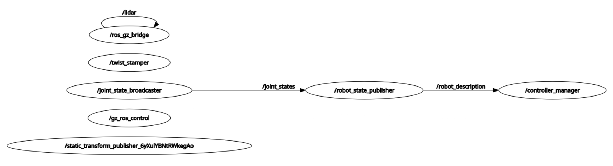

# Day02 - How Robotic Systems Communicate And How You Can Listen

## Intro

* Robot as system of systems: control, perception, navigation, task orchestration, each complex system with subcomponents and all must share info in real time
* ROS as Discord for Robots: a well structured, heavily moderated chat where nodes (single purpose, unitary programs) exchange information in predefined formats, by publishing and/or subscribing to channels dedicated to specific topics
* brushed up on basic ros2 CLI commands to explore an unfamiliar robot system: list nodes and topics, listen to a topic, graphing the system with `rqt_graph` . Beyond that: 

## Linux command line crash course

To open a terminal inside the docker 

* In VsCode with Dev Containers : **View** -> **Terminal** or CTRL + ñ or clicking on the `+`icon 

* either through the GUI with click on Terminator in the VNC GUI

* A short intro to linux commands, arguments and (short hand and long hand) flags, the command prompt `<user>@<computer>:<directory>$`
* `bash` is a programming language!
* why both empty?

```bash
$ echo $ROS_DISTRO

$ echo $IGN_GAZEBO_RESOURCE_PATH

```

* sourcing from outside docker in windows yields the same error message of missing folders. Note:  `.bashrc` does not source for ros jazzy and the workspace (`. install/setup.bash`) or set variables

* learnt about `vcs` tool https://github.com/dirk-thomas/vcstool to manage version control of multiple repos (??)
* fun futuristic command prompt: https://github.com/GitSquared/edex-ui

## Troubleshooting

The refresher on ros2 CLI commands was helpful to troubleshoot because Krytn teleop task runs but the robot does not move, even though `/cmd_vel` topic has traffic. 

Task throws error "Failed to activate controller":

````bash
[...]
[gazebo-1] [ERROR] [1738886097.960364961] [controller_manager]: Switch controller timed out after 5.000000 seconds!
[spawner-7] [ERROR] [1738886097.962109904] [spawner_joint_state_broadcaster]: Failed to activate controller
[ERROR] [spawner-7]: process has died [pid 4396, exit code 1, cmd '/opt/ros/jazzy/lib/controller_manager/spawner joint_state_broadcaster diff_drive_base_controller --ros-args'].
[...]
````

```bash
$ ros2 doctor
[...]
/opt/ros/jazzy/lib/python3.12/site-packages/ros2doctor/api/topic.py: 42: UserWarning: Publisher without subscriber detected on /diff_drive_base_controller/cmd_vel.
/opt/ros/jazzy/lib/python3.12/site-packages/ros2doctor/api/topic.py: 42: UserWarning: Publisher without subscriber detected on /dynamic_joint_states.
/opt/ros/jazzy/lib/python3.12/site-packages/ros2doctor/api/topic.py: 42: UserWarning: Publisher without subscriber detected on /joint_state_broadcaster/transition_event.
[...]
/opt/ros/jazzy/lib/python3.12/site-packages/ros2doctor/api/topic.py: 42: UserWarning: Publisher without subscriber detected on /tf.
/opt/ros/jazzy/lib/python3.12/site-packages/ros2doctor/api/topic.py: 42: UserWarning: Publisher without subscriber detected on /tf_static.

All 5 checks passed

$ ros2 node list
/controller_manager
/gz_ros_control
/joint_state_broadcaster
/robot_state_publisher
/ros_gz_bridge
/rqt_gui_py_node_4393
/static_transform_publisher_6yXulYBNtRWkegAo
/twist_stamper
$ #/diff_drive_base_controller and one additional /static_transform_publisher_XXX are missing!

$ros2 topic list
[...]
$ #/odom missing!
```

```bash
$ ros2 topic echo /cmd_vel
linear:
  x: 0.0
  y: 0.0
  z: 0.0
angular:
  x: 0.0
  y: 0.0
  z: -1.21
---
linear:
  x: 0.0
  y: 0.0
  z: 0.0
angular:
  x: 0.0
  y: 0.0
  z: -1.21
---
[...]
$ ros2 topic info /cmd_vel
Type: geometry_msgs/msg/Twist
Publisher count: 1
Subscription count: 1
$ 
```

My conclusion after a couple of days struggling:

- Recovered the error by running **purge** + **build** tasks iaw John in the Discord **purge** task deletes `install`and `build` folders and then **build** forces to rebuild and repopulate the folder structure inside the docker which I probably messed up calling colcon from outside the docker in the first place. 
- Apparently the repo is symlinked so it can be accessed both from inside or outside the container, but the path is different in eahc case.  Worth trying **purge** + **build** to see if this fixes ubuntu
- may want to add a 3s `TimerAction` to the `joint_state_broadcaster` spawner in `gazebo.launch.py` as proposed in the Discord by Danial Othman. 

- More and more intrigued with docker and devcontainers

## Important note

`/twist_stamper` subscribes to Twist messages in `/cmd_vel` and translates to TwistStamped messages which it publishes on `/diff_drive_base_controller/TwistStamped`  

```bash
$ros2 interface show geometry_msgs/msg/TwistStamped
```

## Bonus

A couple of tools beyond the old `rqt_graph` to interrogate an unfamiliar ROS2 system



* https://github.com/julianmueller/insight_gui

Seen here: https://www.linkedin.com/posts/ahcorde_ros-ros2-opensource-activity-7291100454443216897-L__N

Insight - a modern, user-friendly GUI for ROS 2

Current GUI Features

The application already supports several core functionalities for interacting with ROS2:

 \- Viewing Nodes: Display detailed information about running nodes  (similar to ros2 node list and ros2 node info), including their topics,  services, and more.

 \- Viewing Topics: List all topics (similar to ros2 topic list),  inspect details of specific topics (similar to ros2 topic info), and  view message definitions.

 \- Viewing Services: List all services (similar to ros2 service  list), inspect specific services (similar to ros2 service info), and  view message definitions.

 \- Viewing Actions: List all actions (similar to ros2 action list), inspect specific actions, and view message definitions.

 \- Viewing Message Definitions: Access detailed message structures, including raw definitions. This was the first feature developed and the original motivation for creating the GUI.

 \- Viewing Transformations (TFs): Visualize all coordinate frames  and calculate transformations between frames (similar to ros2 run  tf2_ros tf2_echo source_link target_link).

Key GUI Features

 \- Filtering: Each page includes robust filtering options for quickly finding relevant content.

 \- Navigation: User-friendly navigation, no menu bar.

 \- Nested Pages: Navigate through nested message definitions.

 \- Copy Button: Simply press a button to copy relevant content  (like the command to execute a node, eg. ros2 run turtlesim  turtlesim_node)

 \- View Online: See a message definition in the browser.

 \- Open folder: Open the folder of a package.

* https://github.com/ros2/ros_network_viz

Seen here: https://www.linkedin.com/posts/ahcorde_ros-ros2-network-activity-7288201345226919936-eufA

ros_network_viz This is a utility to visualize the state of an  entire ROS 2 network in a graphical way. This utility will show all of  the nodes in a graph, all of the topics, services, and actions that  connect them, as well as some additional metadata about them.

* https://github.com/dheera/rosboard

ROSboard is a node that turns your robot into a web server to visualize ROS topics

Danial Othman mentioned in the Discord he saw ROSboard in use in the nanosaur project (https://nanosaur.ai/) by Rafaello Bonghi and decided to install it into the BAR container and run it as part of ros2 package.  
