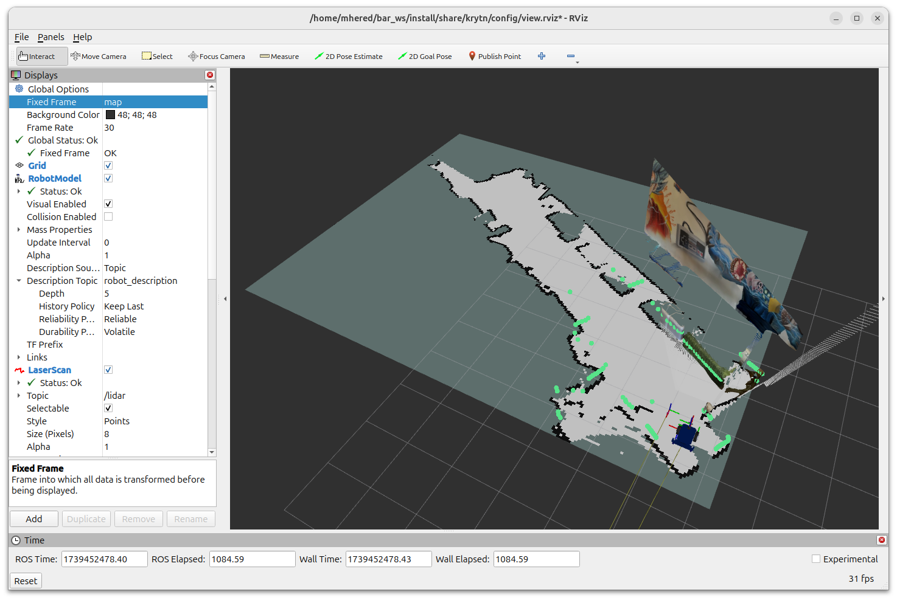
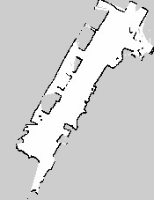

# Day04 - Don't Let Your Robot Become Lost - How To Give It A Map

## Mapping

In the early days mapping and localization were achieved by separate systems, a surprising result was that combining them made both tasks easier. Key idea of SLAM.



## Saving a map

```bash
$ ros2 run nav2_map_server map_saver_cli -t map -f map_mh
[INFO] [1739452388.683229021] [map_saver]: 
        map_saver lifecycle node launched. 
        Waiting on external lifecycle transitions to activate
        See https://design.ros2.org/articles/node_lifecycle.html for more information.
[INFO] [1739452388.683340476] [map_saver]: Creating
[INFO] [1739452388.683415450] [map_saver]: Configuring
[INFO] [1739452388.689260174] [map_saver]: Saving map from 'map' topic to 'map_mh' file
[WARN] [1739452388.689316172] [map_saver]: Free threshold unspecified. Setting it to default value: 0.250000
[WARN] [1739452388.689332845] [map_saver]: Occupied threshold unspecified. Setting it to default value: 0.650000
[WARN] [1739452390.010695615] [map_io]: Image format unspecified. Setting it to: pgm
[INFO] [1739452390.011116490] [map_io]: Received a 175 X 227 map @ 0.05 m/pix
[INFO] [1739452390.023223972] [map_io]: Writing map occupancy data to map_mh.pgm
[INFO] [1739452390.023914551] [map_io]: Writing map metadata to map_mh.yaml
[INFO] [1739452390.024056501] [map_io]: Map saved
[INFO] [1739452390.024070279] [map_saver]: Map saved successfully
[INFO] [1739452390.024967768] [map_saver]: Destroying
```

Generates a `map_mh.yaml` file with metadata:

```yaml
image: map_mh.pgm
mode: trinary
resolution: 0.05
origin: [-7.17, -10.1, 0]
negate: 0
occupied_thresh: 0.65
free_thresh: 0.25
```

And a `map_mh.pgm` bitmap file:



## Inspecting files from `src/bar_examples/krytn/ `


###  `mapping.launch.py`

launches:

- gazebo with`gazebo.launch.py`  
- `slam_toolbox` with `mapping.yaml` as config  file
- `rviz2`with `view.yaml`as config file- Is this an error? Should it be `view.rviz`?

### `config/mapping.yaml`

`slam_toolbox` parameters.

defines the odom, map and base frames, and the scan topic of our robot

other parameters  as starting pose, mode (mapping or navigation) etc

advanced params e.g. solver, algorithm etc

###  `gazebo.launch.py`


### `robot_description/krytn.urdf.xacro`
