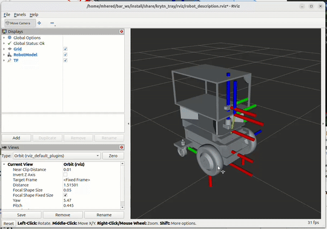

# Day08 - How To Add Your Custom Link To Your Robot

## Setting up FreeCAD

A modern version of FreeCAD is needed that uses a version of python compatible with the python 3.12 used in ubuntu noble:

* downloaded the latest stable Freecad AppImage in their [releases page](https://github.com/FreeCAD/FreeCAD/releases)  [FreeCAD_1.0.0-conda-Linux-x86_64-py311.AppImage](https://github.com/FreeCAD/FreeCAD/releases/download/1.0.0/FreeCAD_1.0.0-conda-Linux-x86_64-py311.AppImage) (uses python 3.11) 

* installed it - I used [AppImageLauncher](https://github.com/TheAssassin/AppImageLauncher/releases), an app that takes care of moving the `*.AppImage` to `~/Applications` folder, giving it execution permission, and integrating the App icon in the desktop. Just double-click on the file and click on **Integrate and Run**, this copied the executable to the following path:

```bash
/home/mhered/Applications/FreeCAD_1.0.0-conda-Linux-x86_64-py311_762d03e714090fee85c2cd69af722050.AppImage
```

## Setting up CROSS

Followed instructions in the repo https://github.com/galou/freecad.cross TLDR; install from FreeCAD as AddOn

- In FreeCAD, menu "Edit / Preferences ..."
- Category "Addon Manager"
- Add an entry to "Custom repository" by clicking on the "+" sign.
- Repository URL: `https://github.com/galou/freecad.cross.git`, branch: `main`
- Click on "OK" to close the dialog "Preferences"
- Back to FreeCAD's main window, menu "Tools / Addon manager"
- Search and install the workbench via the [Addon Manager](https://wiki.freecad.org/Std_AddonMgr)

## Launching FreeCAD with CROSS

As explained in the repo instructions, to be able to use ROS-related functionalities of the CROSS workbench FreeCAD must be launched from the command line as follows (otherwise CROSS will have limited functionality):

- Open a terminal
- Source your ROS workspace
- Launch FreeCAD with the extra Python modules set by ROS, `freecad --module-path ${PYTHONPATH//:/' --module-path '}` (replacing `freecad` by your FreeCAD executable). This bash magic will add for example `--module-path path1 --module-path path2` if `$PYTHONPATH` is `path1:path2`.

Implemented in `./run_freecad_baremetal.sh` (edited from the original `.vscode/scripts/run_freecad.bash` to move to workspace folder and point at the right executable:

```bash
#!/bin/bash

source /opt/ros/jazzy/setup.bash
source install/setup.bash

echo "Starting FreeCAD, please wait ..."
export ROS_DISTRO=jazzy
/home/mhered/Applications/FreeCAD_1.0.0-conda-Linux-x86_64-py311_762d03e714090fee85c2cd69af722050.AppImage --appimage-extract-and-run --module-path ${PYTHONPATH//:/' --module-path '} 
```

## Integrating the tray

QUESTION Is this needed in the end? `$ pip3 install urdf-parser-py --break-system-packages` ?? With the old version of FreeCAD the import URDF option in the CROSS bench was grayed out and I got the warning message: `No module named 'urdf_parser_py'` but it seems to work now...

1. Launch FreeCAD with ROS 
2. Open the file `krytn_tray_ex.FCStd` from Day07
3. In CROSS workbench **Import URDF** from `src/bar_examples/krytn/robot_description/krytn.urdf.xacro`. Ignore `Unknown attribute` errors.
4. **New Link** > rename `krytn_tray` > IMPORTANT: Right-click in **Base**, tick **Show Hidden** > You need to rename both **Label** and **Label2**!!
5. Set **Collision**, **Real** and **Visual** to the `Krytn_tray_part` part that was created 
6. **New Joint** > rename `tray_joint` (both **Label** and **Label2**!!)
7. Origin > Click on `...` > align the new part in place (Useful!!) 

8. Click on the robot `krytn` > **Export** > **Output Path** create a new folder `krytn_tray`under `src`, ignore error `[Errno 2] No such file or directory: '/home/mhered/bar_ws/install:/home/mhered/dev_ws'`
9. With the robot highlighted click on **Export URDF**. Select all files then **Generate Files**

```bash
.
├── CMakeLists.txt
├── launch
│   ├── description.launch.py
│   ├── display.launch.py
│   └── gazebo.launch.py
├── meshes
│   ├── krytn_tray_ex_Body.dae
│   ├── krytn_tray_ex_caster_wheel.dae.dae
│   ├── krytn_tray_ex_collision_base_footprint_.dae
│   ├── krytn_tray_ex_front_wheel.dae.dae
│   ├── krytn_tray_ex_lidar_2d_v1.dae.dae
│   ├── krytn_tray_ex_magni_body.dae.dae
│   ├── krytn_tray_ex_realsense.dae.dae
│   └── krytn_tray_ex_visual_base_footprint_.dae
├── package.xml
├── rviz
│   └── robot_description.rviz
└── urdf
    └── krytn.urdf
```

8. In terminal build to create a new package `krytn_tray`, source and launch `display.launch.py`

```bash
$ colcon build --merge-install --symlink-install
$ source install/setup.bash
$ ros2 launch krytn_tray display.launch.py
```



9. review the `krytn_tray/urdf/krytn.urdf`
10. copy `krytn_tray` link and `krytn_joint` joint over to the original `krytn.urdf.xacro` file, replacing the dummy inertia with an estimate 1kg box 400x280x22mm (pasted macro `<xacro:box_inertial_with_origin>` from `magni.urdf.xacro`)

```xml
  <link name="krytn_tray">
    <visual>
      <!--Krytn_tray_part/Body.-->
      <origin rpy="0.0 -0.0 0.0" xyz="0.0 0.0 0.0"/>
      <geometry>
        <mesh filename="package://krytn_tray/meshes/krytn_tray_ex_Body.dae"/>
      </geometry>
    </visual>
    <collision>
      <!--Krytn_tray_part/Body.-->
      <origin rpy="0.0 -0.0 0.0" xyz="0.0 0.0 0.0"/>
      <geometry>
        <mesh filename="package://krytn_tray/meshes/krytn_tray_ex_Body.dae"/>
      </geometry>
    </collision>
      
    <xacro:box_inertial_with_origin x="0.400" y="0.280" z="0.220" mass="1.0">
      <origin xyz="0.0 0.0 0.0" rpy="0 0 0" />
    </xacro:box_inertial_with_origin>  
      
  </link>
 <joint name="krytn_joint" type="fixed">
    <parent link="base_link"/>
    <child link="krytn_tray"/>
    <origin rpy="0.0 -0.0 0.0" xyz="0.052 0.0 0.264"/>
  </joint>
```

Note: works because magni file included at the beginning of krytn.urdf.xacro:

```xml
  <xacro:include filename="$(find magni_description)/urdf/magni.urdf.xacro" />
```

## URDF and Xacro walkthrough

See video: https://youtu.be/Fyey923jWlM

URDF (Universal Robot Description Format) is a format to describe robots based on XML

with two main tags: `<link>` (parts of the robot) and `<joint>` (connections)

Eror prone: unmatched end tags, forgotten quotes ("), missing critical properties give criptic errors difficult to debug

XACRO is an XML macro language to help

Need to start file with `<robot>` tag with `xmlns` string:
```xml 
<robot xmlns:xacro="http://www.ros.org/wiki/xacro" name="krytn" encoding='UTF-8'>
```

Can include files, e.g. `  <xacro:include filename="$(find magni_description)/urdf/magni.urdf.xacro" />` important for modularity and readibility

Can define macros with parameters, e.g. below x,y,z, mass and a whole `origin` tag

```xml
<xacro:macro name="box_inertial_with_origin" params="x y z mass *origin">
	<inertial>
    	<mass value="${mass}" />
        <xacro:insert_block name="origin" />
        <inertia ixx="${0.0833333  mass  (y*y + z*z)}" ixy="0.0" ixz="0.0" iyy="${0.0833333  mass  (x*x + z*z)}" iyz="0.0" izz="${0.0833333  mass  (x*x + y*y)}" />
	</inertial>
</xacro:macro>
```

Can run macros (inserts the block replacing variables), e.g.

```xml
<xacro:box_inertial_with_origin x="0.398" y="0.221" z="0.150" mass="10.0">
	<origin xyz="-0.15 0 0.03" rpy="0 0 0" />
</xacro:box_inertial_with_origin>
```

Can do math `ixx="${0.0833333  mass  (y*y + z*z)}" `or `rpy="0 ${pi/2} 0"` 

Conditionals:

```xml
<xacro:if value="True">
<!-- do something -->
</xacro:if>
```

Troubleshooting tip: run the xacro command yourself and send the output to a file use `-v`for verbose error details

```bash
xacro -v src/bar_examples/magni_description/urdf/magni.urdf.xacro > out.urdf
```

### Inspecting `./src/bar_examples/magni_description/urdf/magni.urdf.xacro`

with two main tags:

`<link>` (parts of the robot) 

`<joint>` (connections / transforms between parent and child links)

* Self closing <tag/> or 

* open and close tags with a body <tag></tag>
