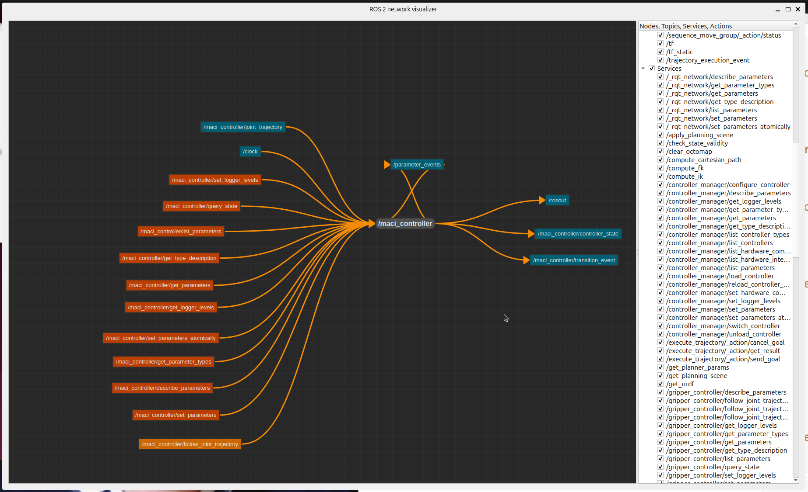

# Day11 - 7 Useful Commands That Will Let You Interrogate Any ROS 2 System

# Summary

```bash
$ ros2 topic list # list topics
$ ros2 topic info /topic_name # message type and count of pub/subs (no node names)
$ ros2 topic info -v /topic_name # verbose, identifies nodes
$ ros2 echo topic /topic_name # to see the traffic

$ ros2 interface show type_name # inspect the type of topics, services or actions

$ ros2 node list # list nodes
$ ros2 node info /node_name # lists topic pubs/subs and service and action 										# servers/clients  and their formats

$ ros2 service list # list services
$ ros2 service info /service_name # type, count of client and server nodes (no names)

$ ros2 action list # list actions
$ ros2 action info /action_name # list of client and server nodes
$ ros2 action type /action_name # get action type

$ ros2 launch package launch_file # execute a launch file

$ ros2 control list_controllers # high level controllers, hardware independent
$ ros2 control list_hardware_interfaces # low level hardware controllers
```

## `ros_viz_network`: a GUI to visualize nodes, topics, services and actions

Source: https://github.com/ros2/ros_network_viz



### Install and run

```bash
# clone repo to a shared location
$ mkdir -p ~/git/src
$ cd ~/git/src
$ git clone https://github.com/ros2/ros_network_viz.git

# symlink it to our workspace
$ ln -s ~/git/src/ros_network_viz ~/bar_ws/src
$ cd ~/bar_ws

# initialize rosdep (first use of rosdep only)
$ sudo rosdep init

# install dependencies
$ rosdep update
$ rosdep install --from-paths src --ignore-src --default-yes

# build source and execute
$ colcon build --merge-install --symlink-install
$ source install/setup.bash
$ ros2 run ros_network_viz ros_network_viz
```


## Task

Note: I interrogated both systems using the CLI to troubleshoot why the container was working and not the baremetal, but did not find differences. See stdout for [containerized](./bash_container.md) and [baremetal](./bash_baremetal.md). 

1. Look at `.vscode/scripts/maci_gazebo.sh` , try running each command in that file one at a time in the command line. What does each line do? 

```bash
#!/bin/bash
bash .vscode/scripts/build.sh # executes build.sh which recompiles the workspace*
source install/setup.bash # source the workspace
ros2 launch maci gazebo.launch.py # executes launch file gazebo.launch.py in maci package
```

Note: `source` vs `bash`:  `source` operates in the current shell and can affect variables in the current shell. `bash` invokes a new shell and that shell cannot affect the environment of its parent. 

Note: `build.sh`sources ROS jazzy and the workspace, mutes some warnings and updates some paths so gazebo can find stuff then build the workspace with colcon:

```bash
#!/bin/bash
source /opt/ros/jazzy/local_setup.bash
source install/setup.bash
PYTHONWARNINGS="ignore:setup.py install is deprecated::setuptools.command.install,ignore:easy_install command is deprecated::setuptools.command.easy_install"; 
export PYTHONWARNINGS
export SDF_PATH=/workspace/install/krytn/share:/workspace/install/krytn/:/opt/ros/jazzy/share/
export GZ_SIM_RESOURCE_PATH=$SDF_PATH
export RCUTILS_COLOURIZE_OUTPUT=1

colcon build --symlink-install --merge-install
```


1. Start `maci_gazebo` task running. This system has lots of moving parts: 

2.  Use `ros2 node list` to look at the nodes running 

3. Use `ros2 node info` to get information about the nodes. Notice the topics and the actions.

4. Use `ros2 action list` to get a list of all the actions in the system. What nodes are responsible for these actions? 

5. There are 5 actions:

   *  `/move_group` is the server for three of them:`/execute_trajectory`, `/move_action` and `/sequence_move_group`. 

   ```
       /execute_trajectory: moveit_msgs/action/ExecuteTrajectory
       /move_action: moveit_msgs/action/MoveGroup
       /sequence_move_group: moveit_msgs/action/MoveGroupSequence
   ```

   * `/gripper_controller` is the server for  `/gripper_controller/follow_joint_trajectory` with type `control_msgs/action/FollowJointTrajectory`
   *  `/maci_controller` is the server of `/gripper_controller/follow_joint_trajectory` with type `control_msgs/action/FollowJointTrajectory`

```bash
$ ros2 action list
/execute_trajectory
/gripper_controller/follow_joint_trajectory
/maci_controller/follow_joint_trajectory
/move_action
/sequence_move_group
$ ros2 action info /execute_trajectory 
Action: /execute_trajectory
Action clients: 1
    /rviz
Action servers: 1
    /move_group
$ ros2 node info /move_group 
/move_group
  Subscribers:
    /clock: rosgraph_msgs/msg/Clock
    /parameter_events: rcl_interfaces/msg/ParameterEvent
    /realsense/points: sensor_msgs/msg/PointCloud2
    /trajectory_execution_event: std_msgs/msg/String
  Publishers:
    /display_contacts: visualization_msgs/msg/MarkerArray
    /display_planned_path: moveit_msgs/msg/DisplayTrajectory
    /filtered_cloud: sensor_msgs/msg/PointCloud2
    /parameter_events: rcl_interfaces/msg/ParameterEvent
    /pipeline_state: moveit_msgs/msg/PipelineState
    /robot_description_semantic: std_msgs/msg/String
    /rosout: rcl_interfaces/msg/Log
  Service Servers:
    /apply_planning_scene: moveit_msgs/srv/ApplyPlanningScene
    /check_state_validity: moveit_msgs/srv/GetStateValidity
    /clear_octomap: std_srvs/srv/Empty
    /compute_cartesian_path: moveit_msgs/srv/GetCartesianPath
    /compute_fk: moveit_msgs/srv/GetPositionFK
    /compute_ik: moveit_msgs/srv/GetPositionIK
    /get_planner_params: moveit_msgs/srv/GetPlannerParams
    /get_urdf: moveit_msgs/srv/GetGroupUrdf
    /load_geometry_from_file: moveit_msgs/srv/LoadGeometryFromFile
    /load_map: moveit_msgs/srv/LoadMap
    /move_group/describe_parameters: rcl_interfaces/srv/DescribeParameters
    /move_group/get_parameter_types: rcl_interfaces/srv/GetParameterTypes
    /move_group/get_parameters: rcl_interfaces/srv/GetParameters
    /move_group/get_type_description: type_description_interfaces/srv/GetTypeDescription
    /move_group/list_parameters: rcl_interfaces/srv/ListParameters
    /move_group/set_parameters: rcl_interfaces/srv/SetParameters
    /move_group/set_parameters_atomically: rcl_interfaces/srv/SetParametersAtomically
    /plan_kinematic_path: moveit_msgs/srv/GetMotionPlan
    /plan_sequence_path: moveit_msgs/srv/GetMotionSequence
    /query_planner_interface: moveit_msgs/srv/QueryPlannerInterfaces
    /save_geometry_to_file: moveit_msgs/srv/SaveGeometryToFile
    /save_map: moveit_msgs/srv/SaveMap
    /set_planner_params: moveit_msgs/srv/SetPlannerParams
  Service Clients:

  Action Servers:
    /execute_trajectory: moveit_msgs/action/ExecuteTrajectory
    /move_action: moveit_msgs/action/MoveGroup
    /sequence_move_group: moveit_msgs/action/MoveGroupSequence
  Action Clients:

$ ros2 action info /gripper_controller/follow_joint_trajectory 
Action: /gripper_controller/follow_joint_trajectory
Action clients: 1
    /moveit_simple_controller_manager
Action servers: 1
    /gripper_controller
$ ros2 node info /gripper_controller 
/gripper_controller
  Subscribers:
    /clock: rosgraph_msgs/msg/Clock
    /gripper_controller/joint_trajectory: trajectory_msgs/msg/JointTrajectory
    /parameter_events: rcl_interfaces/msg/ParameterEvent
  Publishers:
    /gripper_controller/controller_state: control_msgs/msg/JointTrajectoryControllerState
    /gripper_controller/transition_event: lifecycle_msgs/msg/TransitionEvent
    /parameter_events: rcl_interfaces/msg/ParameterEvent
    /rosout: rcl_interfaces/msg/Log
  Service Servers:
    /gripper_controller/describe_parameters: rcl_interfaces/srv/DescribeParameters
    /gripper_controller/get_logger_levels: rcl_interfaces/srv/GetLoggerLevels
    /gripper_controller/get_parameter_types: rcl_interfaces/srv/GetParameterTypes
    /gripper_controller/get_parameters: rcl_interfaces/srv/GetParameters
    /gripper_controller/get_type_description: type_description_interfaces/srv/GetTypeDescription
    /gripper_controller/list_parameters: rcl_interfaces/srv/ListParameters
    /gripper_controller/query_state: control_msgs/srv/QueryTrajectoryState
    /gripper_controller/set_logger_levels: rcl_interfaces/srv/SetLoggerLevels
    /gripper_controller/set_parameters: rcl_interfaces/srv/SetParameters
    /gripper_controller/set_parameters_atomically: rcl_interfaces/srv/SetParametersAtomically
  Service Clients:

  Action Servers:
    /gripper_controller/follow_joint_trajectory: control_msgs/action/FollowJointTrajectory
  Action Clients:

$ ros2 action info /maci_controller/follow_joint_trajectory 
Action: /maci_controller/follow_joint_trajectory
Action clients: 1
    /moveit_simple_controller_manager
Action servers: 1
    /maci_controller
$ ros2 node info /maci_controller 
/maci_controller
  Subscribers:
    /clock: rosgraph_msgs/msg/Clock
    /maci_controller/joint_trajectory: trajectory_msgs/msg/JointTrajectory
    /parameter_events: rcl_interfaces/msg/ParameterEvent
  Publishers:
    /maci_controller/controller_state: control_msgs/msg/JointTrajectoryControllerState
    /maci_controller/transition_event: lifecycle_msgs/msg/TransitionEvent
    /parameter_events: rcl_interfaces/msg/ParameterEvent
    /rosout: rcl_interfaces/msg/Log
  Service Servers:
    /maci_controller/describe_parameters: rcl_interfaces/srv/DescribeParameters
    /maci_controller/get_logger_levels: rcl_interfaces/srv/GetLoggerLevels
    /maci_controller/get_parameter_types: rcl_interfaces/srv/GetParameterTypes
    /maci_controller/get_parameters: rcl_interfaces/srv/GetParameters
    /maci_controller/get_type_description: type_description_interfaces/srv/GetTypeDescription
    /maci_controller/list_parameters: rcl_interfaces/srv/ListParameters
    /maci_controller/query_state: control_msgs/srv/QueryTrajectoryState
    /maci_controller/set_logger_levels: rcl_interfaces/srv/SetLoggerLevels
    /maci_controller/set_parameters: rcl_interfaces/srv/SetParameters
    /maci_controller/set_parameters_atomically: rcl_interfaces/srv/SetParametersAtomically
  Service Clients:

  Action Servers:
    /maci_controller/follow_joint_trajectory: control_msgs/action/FollowJointTrajectory
  Action Clients:
```


5. Use `ros2 interface show` to show the data type of a topic and an action. 

​	Action `control_msgs/action/FollowJointTrajectory` is very complex!

​	Action type defines 3 formats: input data, intermediate feedback,  goal response

```
$ ros2 topic info /realsense/depth

Type: sensor_msgs/msg/Image
Publisher count: 1
Subscription count: 0

$ ros2 interface show sensor_msgs/msg/Image
# This message contains an uncompressed image
# (0, 0) is at top-left corner of image

std_msgs/Header header # Header timestamp should be acquisition time of image
        builtin_interfaces/Time stamp
                int32 sec
                uint32 nanosec
        string frame_id
                             # Header frame_id should be optical frame of camera
                             # origin of frame should be optical center of cameara
                             # +x should point to the right in the image
                             # +y should point down in the image
                             # +z should point into to plane of the image
                             # If the frame_id here and the frame_id of the CameraInfo
                             # message associated with the image conflict
                             # the behavior is undefined

uint32 height                # image height, that is, number of rows
uint32 width                 # image width, that is, number of columns

# The legal values for encoding are in file include/sensor_msgs/image_encodings.hpp
# If you want to standardize a new string format, join
# ros-users@lists.ros.org and send an email proposing a new encoding.

string encoding       # Encoding of pixels -- channel meaning, ordering, size
                      # taken from the list of strings in include/sensor_msgs/image_encodings.hpp

uint8 is_bigendian    # is this data bigendian?
uint32 step           # Full row length in bytes
uint8[] data          # actual matrix data, size is (step * rows)
```


5. Use `ros2 control list_controllers` to see a list of controllers, what do they do? 

```bash
$ ros2 control list_controllers 
[INFO] [1740430569.392864652] [_ros2cli_542773]: waiting for service /controller_manager/list_controllers to become available...
gripper_controller           joint_trajectory_controller/JointTrajectoryController  active
maci_controller              joint_trajectory_controller/JointTrajectoryController  active
maci_joint_state_broadcaster joint_state_broadcaster/JointStateBroadcaster          active
```

​	`gripper_controller` and `maci_controller` send control commands to the joints to follow trajectories

​	`maci_joint_state_broadcaster` broadcasts position of the joints, but does not actually control

5. Use `ros2 control list_hardware_interfaces` to see a list of hardware interfaces, how are these different from the controllers? 

* command interfaces: for each joint. ros2_control ensures only 1 hardware controller per joint (tags as [claimed]) to prevent conflicts

* state interfaces: variables published 

```bash
$ ros2 control list_hardware_interfaces
[INFO] [1740430639.463935408] [_ros2cli_543334]: waiting for service /controller_manager/list_hardware_interfaces to become available...
command interfaces
        finger_joint/position [available] [claimed]
        left_inner_finger_joint/position [available] [claimed]
        right_inner_finger_joint/position [available] [claimed]
        right_outer_knuckle_joint/position [available] [claimed]
        ur5_elbow_joint/position [available] [claimed]
        ur5_shoulder_lift_joint/position [available] [claimed]
        ur5_shoulder_pan_joint/position [available] [claimed]
        ur5_wrist_1_joint/position [available] [claimed]
        ur5_wrist_2_joint/position [available] [claimed]
        ur5_wrist_3_joint/position [available] [claimed]
state interfaces
        finger_joint/position
        finger_joint/velocity
        left_inner_finger_joint/position
        left_inner_finger_joint/velocity
        right_inner_finger_joint/position
        right_inner_finger_joint/velocity
        right_outer_knuckle_joint/position
        right_outer_knuckle_joint/velocity
        ur5_elbow_joint/position
        ur5_elbow_joint/velocity
        ur5_shoulder_lift_joint/position
        ur5_shoulder_lift_joint/velocity
        ur5_shoulder_pan_joint/position
        ur5_shoulder_pan_joint/velocity
        ur5_wrist_1_joint/position
        ur5_wrist_1_joint/velocity
        ur5_wrist_2_joint/position
        ur5_wrist_2_joint/velocity
        ur5_wrist_3_joint/position
        ur5_wrist_3_joint/velocity
```

5. Use `ros2 service list` to look at the different services that are running. 

​	loong list!

5. Use `ros2 run maci maci_joint_move.py` to experiment with running ros2 nodes from the command line. 

​	does not exist...

5. Boot up your favourite example so far (either a Maci or Krytn) and  investigate the nodes. Choose one node and investigate its topics, services and actions. Create a diagram of how that one node connects to others in the system. 

