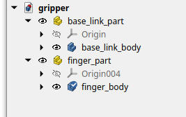
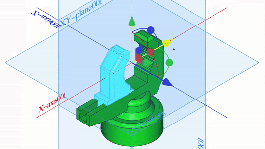

# Day12 - 3 Steps To Designing A Simple Gripper In CAD

## Design a gripper to hold a coke can

Create two parts each with a body inside: a hand (`base_link`, shown in green) and a moving finger (`finger`, shown in light blue)





Data:

* Coke can diameter: 66mm

* Wrist dimensions: 100mm diameter 40mm height

## Export it to ROS

1. Launch the CROSS workbench - must have launched FreeCAD with:

 ```bash
 $ source ~/bar_ws/run_freecad_baremetal.bash
 ```

2. Create a new robot. Activate it. Right-click + tick **Show hidden**, rename `my_robot_arm` (**Label** + **Label2**). Set **Output Path** to a new folder `~/bar_ws/src/` (ignore File not Found error)

3. With the robot selected, add two links and a joint

   * rename the first `base_link`  (**Label** + **Label2**), add `base_link_part` to **Collision**, **Real** and **Visual**

   * rename the second `finger_link`  (**Label** + **Label2**), add `finger_link_part` to **Collision**, **Real** and **Visual**

   * rename the joint `finger_joint` (**Label** + **Label2**), set **Parent** to `base_link`and **Child** to `finger_link` , set **Type** to `prismatic`, if necessary adjust **Origin** to align the parts in the open position of the gripper (in my case x=-35). Set reasonable **Limits**: 
     * Effort: 1000
     * Lower Limit: -5
     * Upper Limit: 35 
     * Velocity: 1

4. **Export to URDF** > **Select all** > **Generate files**

5. build, source and launch gazebo:

```bash
$ colcon build --merge-install --symlink-install
$ source install/setup.bash
$ ros2 launch my_robot_arm display.launch.py
```

6. if necessary in `~/bar_ws/src/my_robot_arm/urdf/my_robot_arm.urdf `modify manually the `<axis>` tag of `finger_joint` and rebuild
