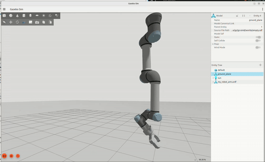
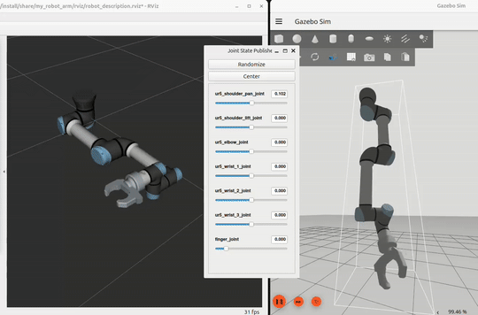
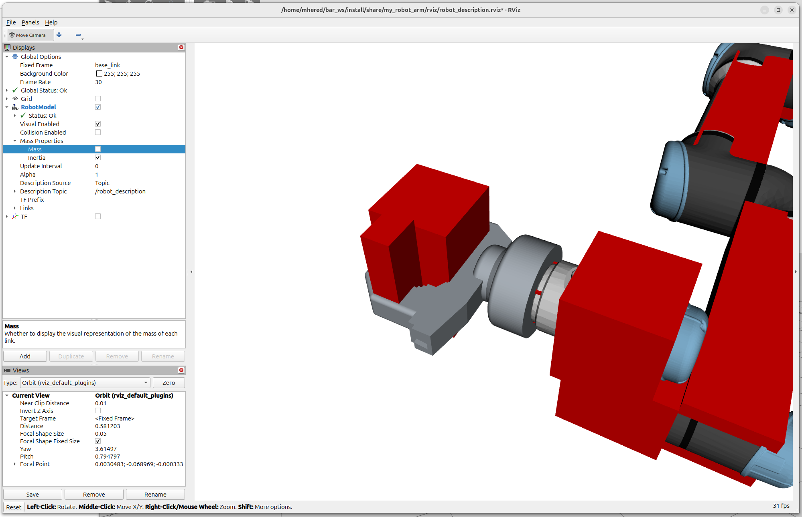
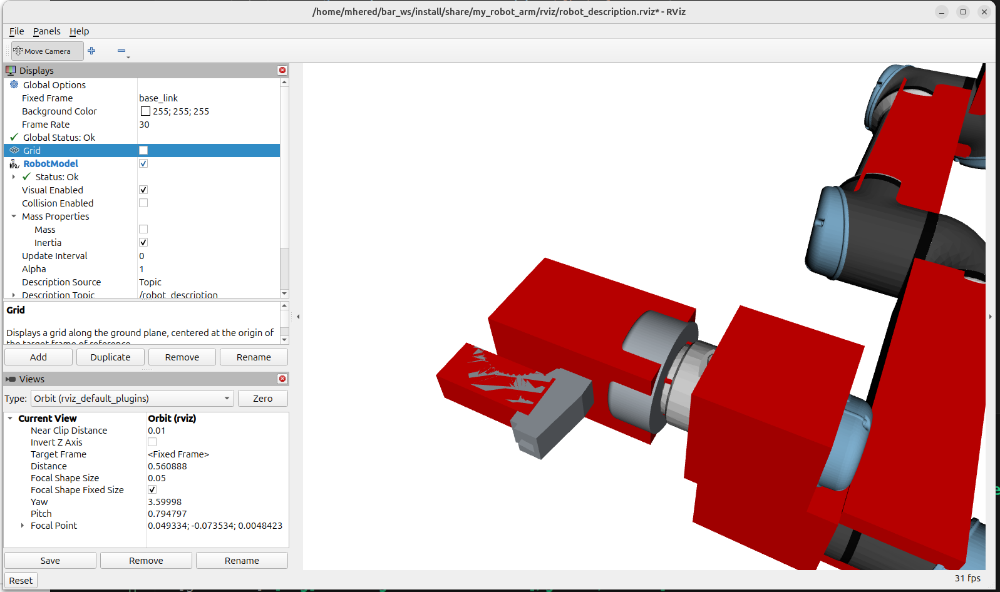

# Day13 - How To Install A Gripper On Your Robot Arm In Simulation

## Task

Create a xacro file that describes our gripper attached to the ur5 arm

1. Make a copy of `my_robot_arm.urdf` and rename it `my_robot_arm.urdf.xacro` 
2. Modify the `<xml>` and `<robot>`  tags to make this a xacro file copying from  `maci/robot_description/maci.urdf.xacro` 
3. Copy also the includes for the inertial macros and the UR05 arm, and the world link

```xml
<?xml version='1.0' encoding='utf-8'?>
<robot xmlns:xacro="http://www.ros.org/wiki/xacro" name="my_robot_arm">

    <xacro:include filename="$(find magni_description)/urdf/inertial.xacro" />

    <!-- Include a UR05 arm -->
    <xacro:include filename="$(find ur_description)/urdf/ur_macro.xacro" />
    <xacro:arg name="ur_type" default="ur5e"/>

    <xacro:ur_robot name="ur5" tf_prefix="ur5_" parent="world" joint_limits_parameters_file="$(find ur_description)/config/$(arg ur_type)/joint_limits.yaml" kinematics_parameters_file="$(find ur_description)/config/$(arg ur_type)/default_kinematics.yaml" physical_parameters_file="$(find ur_description)/config/$(arg ur_type)/physical_parameters.yaml" visual_parameters_file="$(find ur_description)/config/$(arg ur_type)/visual_parameters.yaml">
        <origin xyz="-0.1 0 0.15" rpy="${pi} 0 0" />
    </xacro:ur_robot>
    
    <link name="world" />
    
    <!--Generated by CROSS, a ROS Workbench for FreeCAD (https://github.com/galou/freecad.cross)-->
  	<link name="base_link">
  	...
```

3. Add inertia to the gripper `base_link` and the `finger_link` by replacing the `<inertial>` tags (CROSS gave them null values) with appropriate inertia macros from `magni_description` package. 

   We assimilate `base_link` to a 1kg cylinder 100mm diameter and 150mm height:

``` xml
<link name="base_link">
   ...
    <!--cylinder 50mm radius 150mm height 1.0kg-->    
    <xacro:cylinder_inertial_with_origin radius="0.05" length="0.15" mass="1.0">
    	<origin xyz="0.0 0.0 0.0" rpy="0 0.0 0.0" />
    </xacro:cylinder_inertial_with_origin>
</link>
```

Note: `cylinder_inertial`fails with `Not enough blocks` error	

And assimilate `finger_link` to a 40x30x100mm box offset by -35mm in x and 40mm in z with 100g mass

```xml
  <link name="finger_link">
      ...
    <!--box 40x30x100mm 0.1kg offset by -35mm in x and 40mm in z-->
    <xacro:box_inertial_with_origin x="0.04" y="0.03" z="0.1" mass="0.1">
    	<origin xyz="-0.035 0 0.04" rpy="0 0 0" />
    </xacro:box_inertial_with_origin>    
</link>
```

4. Add a new joint to connect the end of the gripper `ur5_tool0` link to the base link of your gripper. Apply the trasnform needed so the position and orientation of the gripper is correct (in our case rotate 90 deg in x or roll, then move 127mm in z axis)

```xml
  <!-- fixed joint to attach gripper to ur05 arm-->
  <joint name="gripper_joint" type="fixed">
    <parent link="ur5_tool0" />
    <child link="base_link" />
    <origin rpy="${pi/2} 0.0 0.0" xyz="0.0 0.0 0.127"/>
  </joint>
```

5. Modify `description.launch.py`  and `display.launch.py`to load our `my_robot_arm.urdf.xacro`
6. comment out lines 25-37 of `gazebo.launch.py` to allow paths to get setup correctly
7. build and source, then run `ros2 launch my_robot_arm gazebo.launch.py` 
8. We get our gripper on the robot arm simulated in RVIZ and Gazebo. Note: we can control the arm in RVIZ but the arm is flopping around in Gazebo because we haven't setup any control system yet.





In RVIZ visualize inertias and fix axes if needed: **RobotModel** > **Mass Properties** > **Inertia**

Before:



We offset `base_link` by -50mm in y, rotate it 90deg in roll:

``` xml
<link name="base_link">
   ...
   <!--cylinder 50mm radius 150mm height 1.0kg, offset by -50mm in y, rotated 90deg in roll-->     
    <xacro:cylinder_inertial_with_origin radius="0.05" length="0.15" mass="1.0">
      <origin xyz="0 -0.05 0" rpy="${pi/2} 0 0" />
    </xacro:cylinder_inertial_with_origin>
</link>
```

We make `finger_link` shorter (90mm), offset by -40mm in x , rotate 90deg in roll:

```xml
  <link name="finger_link">
      ...
    <!--box 40x30x90mm 0.1kg, offset by -40mm in x, rotated 90deg in roll -->
    <xacro:box_inertial_with_origin x="0.04" y="0.03" z="0.09" mass="0.1">
      <origin xyz="-0.04 0.0 0.0" rpy="${pi/2} 0 0" />
    </xacro:box_inertial_with_origin>   
</link>
```

After:



## Bonus - What are Transforms?

Video: https://www.youtube.com/watch?v=-C4q_TYJs90

Exploring TF in RVIZ:

Tree to see the tree of frames

each sensor has its own frame

You can select any frame as the fixed frame

`/map` and `/odom` move relative to each other: this is how the `slam_toolbox` works fitting info from the sensors to correct odometry errors

In Gazebo you can right click on an entity to move to it

always interesting listening to topic `/joint_states`

In FreeCAD we also create links, each with a coordinate frame, connected by joints which are the transforms 

This is only valid for rigid bodies.

## Bonus 2 - playing with URDF visualizer

Installed URDF Visualizer VSCode extension. Added to `.vscode/settings.json`:

```json
    ...
	"urdf-visualizer.packages": {
        "my_robot_arm": "${workspaceFolder}/src/my_robot_arm",
        "magni_description": "${workspaceFolder}/src/bar_examples/magni_description",
        "ur_description": "/opt/ros/jazzy/share/ur_description"
    }
```

Note: found `ur_description `package using 

```bash
$ find / -type d -name "ur_description" 2>/dev/null
/opt/ros/jazzy/share/ur_description
```

Note: this command searches under root (`/`)  for folders (`-type d`) with the given name. The `2>/dev/null` discards all the `Permission denied` error messages

It works but I get error: `XacroParser: ROS Jade pass-through notation not supported in macro defaults: ^`

Apparently due to the use of deprecated syntax in file `/opt/ros/jazzy/share/ur_description/urdf/ur_macro.xacro`, fixed it replacing`params="name:=^ type:=^"`by `params="name type" `in lines 24 and 29 . Need `sudo` to save the file.

However this raised another error: `XacroParser: Failed to process expression "${sec_limits['shoulder_pan_joint']['min_position']}". Cannot read properties of undefined (reading 'min_position')`
It gets compliated, so I undid the changes. 

But happy I got to this point...

