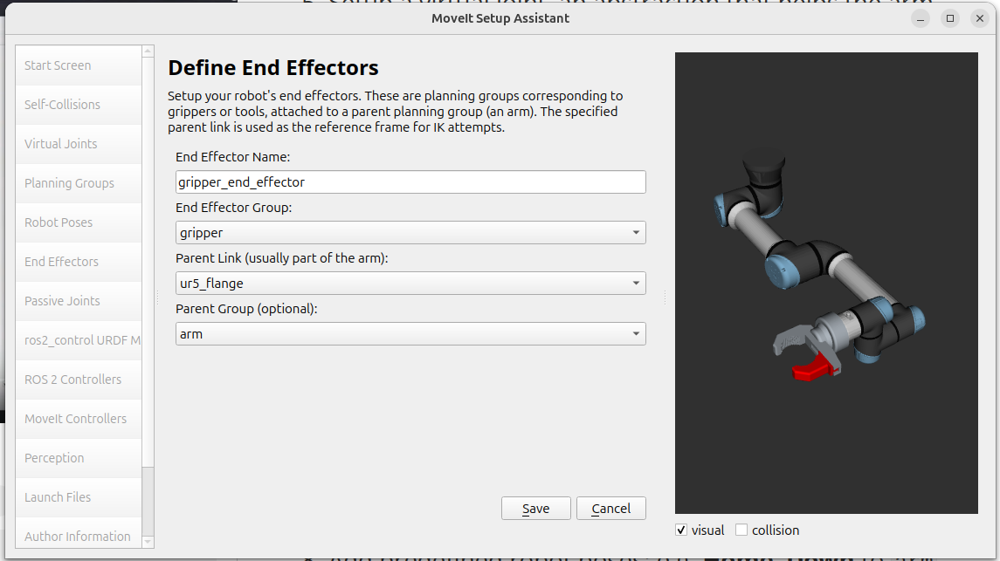

# Day15 - The Easy Way To Setup Your Robot Arm - Configuring MoveIT 2

Setting up one joint was a pain. MoveIt assistant helps setting up a whole arm quickly

## Task

Prerequisite: a valid `my_robot_arm.urdf.xacro`, i.e. make sure arm with gripper show up in Gazebo after running the build task. 

To start MoveIt wizard from `bar_ws` run:

 ```bash
 $ export QT_QPA_PLATFORM=xcb #force X11
 $ ros2 run moveit_setup_assistant moveit_setup_assistant
 ```

Note: the export line forces X11 for the session. Needed in my laptop as otherwise the wizard crashes in Wayland before it starts  

1. **Start Screen** - the teacher recommends creating a new MoveIt package separate from the one where stuff created with FreeCAD CROSS lives. This will later allow running the wizard to modify things iteratively. Select the urdf.xacro file. Then follow the wizard to generate the ros2_control urdf modifications, ros2 control controllers and \moveit control settings as follows:

2. **Self-Collisions** - configure the collision matrix, which identifies links at risk of collision with each other. Use default parameters:

 

5. **Virtual Joints** - Setup a virtual joint, an abstraction that helps the arm planner reason about where the arm is in 3D space. Name it  `vm_joint`, with `world` as child and `ur5_base_link` as parent, `fixed` type. Helpful for robot manipulators and for the solver generally (??). 
6. **Planning Groups** - 
   * Add a planning group for the arm. **Add Group** > name it `arm`, select solver e.g. KDL either cached or not:`cached_ik_kinematics_plugin/CachedKDLKinematicsPlugin`, select a Default Planner e.g. `TRRT`. Then **Add Kin. Chain** > select `ur5_base_link` as **Base link** and `ur5_flange`as **Tip Link**. 
   * Repeat for the `gripper`, this time instead **Add Joint**s > select `finger_joint` > Add
7. **Robot Poses** - Add predefined robot poses: e.g. **Home**, **Down** to `arm` and **Open**, **Closed** to `gripper`. 
8. **End Effectors** - Add gripper group as end effector:



10. **Passive Joints** - some robots have joints which are not actuated, but we don't have them
11. **ros2_control URDF Modifications** - select desired control and state interfaces and click on **Add interfaces**
12. **ROS 2 Controllers** - Click Auto add
13. **MoveIt Controllers** - Click Auto add. This is a middleware between MoveIt planner and ROS2 control, needs to line up.
14. **Perception** - skip setting up the perception system for now.
15. **Launch Files** - unclick Warehouse DB
16. **Author Information** - Fill in author info & email
17. **Configuration Files** - save to a new folder `src/my_robot_arm_moveit` > **Generate Package**. This creates the following files:

```bash
$ tree my_robot_arm_moveit/
my_robot_arm_moveit/
├── CMakeLists.txt
├── config
│   ├── initial_positions.yaml
│   ├── joint_limits.yaml
│   ├── kinematics.yaml
│   ├── moveit_controllers.yaml
│   ├── moveit.rviz
│   ├── my_robot_arm.ros2_control.xacro
│   ├── my_robot_arm.srdf
│   ├── my_robot_arm.urdf.xacro
│   ├── pilz_cartesian_limits.yaml
│   └── ros2_controllers.yaml
├── launch
│   ├── demo.launch.py
│   ├── move_group.launch.py
│   ├── moveit_rviz.launch.py
│   ├── rsp.launch.py
│   ├── setup_assistant.launch.py
│   ├── spawn_controllers.launch.py
│   └── static_virtual_joint_tfs.launch.py
└── package.xml
```

Lets now transfer stuff into `my_robot_arm`:

1. Copy the contents of `src/my_robot_arm_moveit/config/ros2_controllers.yaml` into `src/my_robot_arm/config/ros2_control.yaml` 
2. In `gazebo.launch.py` ensure the `controller_manager` launches all 3 controllers, double checking the controller names are matching:

```python
...
arguments=['joint_state_broadcaster', 'gripper_controller', 'arm_controller'],
...
```

3. From `src/my_robot_arm_moveit/config/my_robot_arm.ros2_control.xacro` copy into `src/my_robot_arm/urdf/my_robot_arm.urdf.xacro` the `ros2_control` definition of the joints (command and state interfaces and their initial value), prepending the definition of xacro parameters:

```xml
    <xacro:property name="initial_positions_file" value="$(find my_robot_arm_moveit)/config/initial_positions.yaml" />
    <xacro:property name="initial_positions" value="${xacro.load_yaml(initial_positions_file)['initial_positions']}"/>
    <joint name="ur5_shoulder_pan_joint">
    	...
    </joint>
	...
    <joint name="finger_joint">
		...
	</joint>        
```

4. From `src/bar_examples/maci/launch/moveit.launch.py` copy the following lines into `src/my_robot_arm/launch/gazebo.launch.py`, replacing the package name from `maci_moveit` to `my_robot_arm_moveit`. These lines execute launch files `move_group.launch.py` and `moveit_rviz.launch.py` from the `my_robot_arm_moveit` package:

```python
from launch.actions import ExecuteProcess 
from os.path import join
...
	move_group = IncludeLaunchDescription(join(get_package_share_directory("my_robot_arm_moveit"), "launch", "move_group.launch.py"))
    rviz = IncludeLaunchDescription(join(get_package_share_directory("my_robot_arm_moveit"), "launch", "moveit_rviz.launch.py"))
    mg_sim_time = ExecuteProcess(cmd=["ros2", "param", "set", "/move_group", "use_sim_time","True"])
    rviz_sim_time = ExecuteProcess(cmd=["ros2", "param", "set", "/rviz", "use_sim_time","True"])
```

Note: by renaming `rviz` this supersedes `display.launch.py`

5. In `gazebo.launch.py` change the default value of `use_rviz` to `false`:

```python
    use_rviz_arg = DeclareLaunchArgument("use_rviz", default_value='false')
```

Otherwise it yields:
```bash
...
[create-3] [INFO] [1741815833.955724210] [ros_gz_sim]: Waiting messages on topic [/robot_description].
[create-3] [INFO] [1741815834.955875857] [ros_gz_sim]: Waiting messages on topic [/robot_description].
[rviz2-1] [ERROR] [1741815835.860912769] [rviz]: Could not find parameter robot_description and did not receive robot_description via std_msgs::msg::String subscription within 10.000000 seconds.
[rviz2-1] Error:   Error=XML_ERROR_EMPTY_DOCUMENT ErrorID=13 (0xd) Line number=0
[rviz2-1]          at line 101 in ./urdf_parser/src/model.cpp
[rviz2-1] Failed to parse robot description using: urdf_xml_parser/URDFXMLParser
[rviz2-1] [INFO] [1741815835.878780788] [moveit_980071912.moveit.ros.rdf_loader]: Unable to parse URDF
[rviz2-1] [ERROR] [1741815835.883700498] [moveit_980071912.moveit.ros.planning_scene_monitor]: Robot model not loaded
```

There are several manual changes needed in some of the files created automatically by the MoveIt wizard in  `my_robot_arm_moveit`: 

5. as workaround to avoid a MoveIT2 bug, add the following line just before the return statement in `src/my_robot_arm_moveit/launch/move_group.launch.py`: 

```python
moveit_config.move_group_capabilities["capabilities"] = ""
```

6. in `src/my_robot_arm_moveit/config/joint_limits.yaml` for all seven joints set `has_acceleration_limits` to `true` and give `max_acceleration` a value of `1.0` . Make sure also `max_velocity: 1000.0` for `finger_joint`

7. to prevent the `namespace collision` / `returned 0 controllers` error, add two `action_ns` lines in `src/my_robot_arm_moveit/config/moveit_controllers.yaml` to define namespaces for `arm_controller`and `gripper_controller`  :

```
# MoveIt uses this configuration for controller management

moveit_controller_manager: moveit_simple_controller_manager/MoveItSimpleControllerManager

moveit_simple_controller_manager:
  controller_names:
    - arm_controller
    - gripper_controller

  arm_controller:
    type: FollowJointTrajectory
    action_ns: follow_joint_trajectory

    joints:
      - ur5_shoulder_pan_joint
      - ur5_shoulder_lift_joint
      - ur5_elbow_joint
      - ur5_wrist_1_joint
      - ur5_wrist_2_joint
      - ur5_wrist_3_joint
  gripper_controller:
    type: FollowJointTrajectory
    action_ns: follow_joint_trajectory
    joints:
      - finger_joint
```

8.  Comment out the fake controller in `src/my_robot_arm_moveit/config/my_robot_arm.urdf.xacro` :

```
...
<!-- <xacro:my_robot_arm_ros2_control name="FakeSystem" initial_positions_file="$(arg initial_positions_file)"/> -->
...
```

9. Execute the `my_robot_arm Gazebo` task (which builds, sources, and launches `gazebo.launch.py`) and teleoperate your robot! 

## Common issues

- there are many settings, use the defaults!
- Don't skip generating the collision matrix. Typically you get the arm all red and not moving.
- No Acceleration Limits error
- Key error "Capabilities"
- MoveIt crashes
- /recognize_objects not available
- planner fails all the time

## Troubleshooting

1.  `initial_positions` not defined error:

```bash
...
[ERROR] [launch]: Caught exception in launch (see debug for traceback): executed command failed. Command: xacro /home/mhered/bar_ws/install/share/my_robot_arm/urdf/my_robot_arm.urdf.xacro
Captured stderr output: error: name 'initial_positions' is not defined 
when evaluating expression 'initial_positions['ur5_shoulder_pan_joint']'
when processing file: /home/mhered/bar_ws/install/share/my_robot_arm/urdf/my_robot_arm.urdf.xacro


 *  The terminal process "/usr/bin/bash '-c', 'bash .vscode/scripts/my_robot_arm_gazebo.sh'" terminated with exit code: 1. 
 *  Terminal will be reused by tasks, press any key to close it. 
```

Fixed: adding two missing xacro property definitions in `src/my_robot_arm/urdf/my_robot_arm.urdf` :

```
<xacro:property name="initial_positions_file" value="$(find my_robot_arm_moveit)/config/initial_positions.yaml" />
    <xacro:property name="initial_positions" value="${xacro.load_yaml(initial_positions_file)['initial_positions']}"/>
```

2. no `/robot_description` error:

```bash
...
[create-3] [INFO] [1741815833.955724210] [ros_gz_sim]: Waiting messages on topic [/robot_description].
[create-3] [INFO] [1741815834.955875857] [ros_gz_sim]: Waiting messages on topic [/robot_description].
[rviz2-1] [ERROR] [1741815835.860912769] [rviz]: Could not find parameter robot_description and did not receive robot_description via std_msgs::msg::String subscription within 10.000000 seconds.
[rviz2-1] Error:   Error=XML_ERROR_EMPTY_DOCUMENT ErrorID=13 (0xd) Line number=0
[rviz2-1]          at line 101 in ./urdf_parser/src/model.cpp
[rviz2-1] Failed to parse robot description using: urdf_xml_parser/URDFXMLParser
[rviz2-1] [INFO] [1741815835.878780788] [moveit_980071912.moveit.ros.rdf_loader]: Unable to parse URDF
[rviz2-1] [ERROR] [1741815835.883700498] [moveit_980071912.moveit.ros.planning_scene_monitor]: Robot model not loaded
```

Fixed: in `gazebo.launch.py` change the default value of `use_rviz` to `false`:

```python
    use_rviz_arg = DeclareLaunchArgument("use_rviz", default_value='false')
```

I saw this fix [in this post](https://discord.com/channels/1209418666290970645/1209418666794422327/1303909838132346922) by Nathan in the Discord, but I don't understand it, and I don't see it mentioned anywhere in the video

3. `namespace collision` / `returned 0 controllers` error 

After this, there are only relatively minor error messages during startup, otherwise controllers are loading, the system seems to be up and running, the arm is not floppy in gazebo, and MoveIt seems to be working well, planning movements succeeds and MoveIt shows the animation ok. 

However, when I try to Execute, it fails with:

```
...
[move_group-6] [INFO] [1741813975.383936107] [move_group.moveit.moveit.ros.move_group.clear_octomap_service]: Execution request received
[move_group-6] [INFO] [1741813975.384005090] [move_group.moveit.moveit.plugins.simple_controller_manager]: Returned 0 controllers in list
[move_group-6] [INFO] [1741813975.384023929] [move_group.moveit.moveit.plugins.simple_controller_manager]: Returned 0 controllers in list
[move_group-6] [INFO] [1741813975.384042397] [move_group.moveit.moveit.plugins.simple_controller_manager]: Returned 0 controllers in list
[move_group-6] [INFO] [1741813975.384050977] [move_group.moveit.moveit.plugins.simple_controller_manager]: Returned 0 controllers in list
[move_group-6] [ERROR] [1741813975.384065426] [move_group.moveit.moveit.ros.trajectory_execution_manager]: Unable to identify any set of controllers that can actuate the specified joints: [ ur5_elbow_joint ur5_shoulder_lift_joint ur5_shoulder_pan_joint ur5_wrist_1_joint ur5_wrist_2_joint ur5_wrist_3_joint ]
[rviz2-2] [INFO] [1741813975.384020628] [moveit_2553292408.moveit.ros.move_group_interface]: Execute request accepted
[move_group-6] [ERROR] [1741813975.384104470] [move_group.moveit.moveit.ros.trajectory_execution_manager]: Known controllers and their joints:
[move_group-6] 
[rviz2-2] [INFO] [1741813975.384259335] [moveit_2553292408.moveit.ros.move_group_interface]: Execute request aborted
[rviz2-2] [ERROR] [1741813975.384761221] [moveit_2553292408.moveit.ros.move_group_interface]: MoveGroupInterface::execute() failed or timeout reached
[rviz2-2] [WARN] [1741813976.031915918] [moveit_2553292408.moveit.ros.planning_scene_monitor]: Maybe failed to update robot state, time diff: 1741813694.015s
```

Error messages I see at startup (see [full log](./log.txt)):

```bash
...
[move_group-6] [ERROR] [1741813686.232944822] [move_group.moveit.moveit.ros.occupancy_map_monitor]: No 3D sensor plugin(s) defined for octomap updates
...
[rviz2-2] Warning: class_loader.impl: SEVERE WARNING!!! A namespace collision has occurred with plugin factory for class rviz_default_plugins::displays::InteractiveMarkerDisplay. New factory will OVERWRITE existing one. This situation occurs when libraries containing plugins are directly linked against an executable (the one running right now generating this message). Please separate plugins out into their own library or just don't link against the library and use either class_loader::ClassLoader/MultiLibraryClassLoader to open.
...
[move_group-6] [ERROR] [1741813686.422033086] [move_group.moveit.moveit.plugins.simple_controller_manager]: No action namespace specified for controller `arm_controller` through parameter `moveit_simple_controller_manager.arm_controller.action_ns`
[move_group-6] [ERROR] [1741813686.422084540] [move_group.moveit.moveit.plugins.simple_controller_manager]: No action namespace specified for controller `gripper_controller` through parameter `moveit_simple_controller_manager.gripper_controller.action_ns`
...
[rviz2-2] [ERROR] [1741813689.387755661] [moveit_2553292408.moveit.ros.motion_planning_frame]: Action server: /recognize_objects not available
...
```

Note: error /recognize_objects not available is expected

Fixed with: add two `action_ns` lines in `src/my_robot_arm_mingoveit/config/moveit_controllers.yaml` to define namespaces for `arm_controller`and `gripper_controller`  


