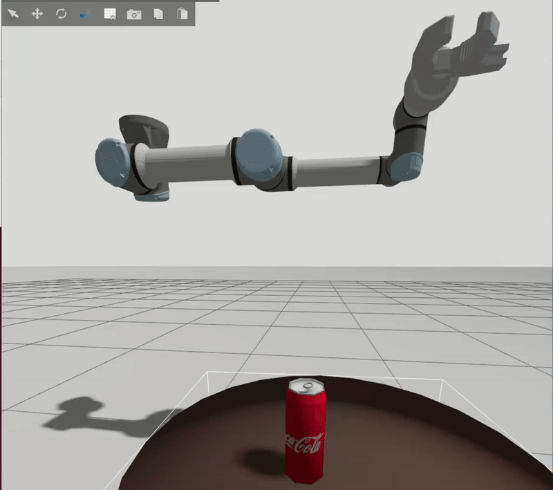
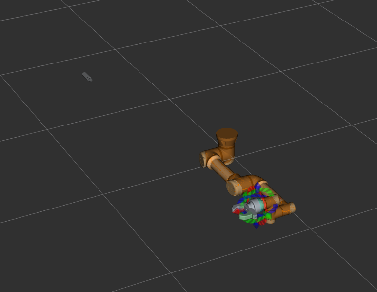

# Day17 - How To Create A Gazebo World - Adding Something To Pickup

## Part 1: Care for a Coke?

1. Launch the simulation: `Ctrl` + `Shift` + `P` > **Tasks: Run Task** > **my_robot_arm Gazebo**

2. Open the **Resource Spawner** and insert a coffee table and a coke can

3. Save the world as `my_robot_arm/urdf/coke_pickup.sdf`, and edit the XML file to:

   * delete the model of the robot arm (will be spawned by the launch file) 

   * set the `Static` tag to `False` for  the Coke model 

   * scale the `visual` and `collision` meshes of the Coke model (the can is too slim) adding `<scale>1.1 1.1 1.1</scale>` 
   * modify the inertial properties of the Coke can. Assumed a solid cylinder approximation for a European Coke can (mass = 0.35 kg, radius = 0.033 m, height = 0.115 m):

```
<inertial>
  <mass>0.35</mass>
  <inertia>
    <ixx>0.000481</ixx>
    <iyy>0.000481</iyy>
    <izz>0.000191</izz>
    <ixy>0</ixy>
    <ixz>0</ixz>
    <iyz>0</iyz>
  </inertia>
  <pose>0 0 0 0 0 0</pose>
</inertial>
```

4. Modify the launch file `gazebo.launch.py` to:

* open the newly created world file instead of the default `empty.sdf`

```python
...
    # Gazebo Sim.
    pkg_ros_gz_sim = get_package_share_directory('ros_gz_sim')

    world_file = os.path.join(
        get_package_share_directory(resources_package),
        'urdf',
        'coke_pickup.sdf'
    )
  
    gazebo = IncludeLaunchDescription(
        PythonLaunchDescriptionSource(
            os.path.join(pkg_ros_gz_sim, 'launch', 'gz_sim.launch.py'),
        ),
        launch_arguments=dict(gz_args=f'-r {world_file} --verbose').items(),
    )
...
```

* spawn the robotic arm a little lower (z=1.0m)

```python
...
	# Step 3. Spawn a robot in gazebo by listening to the published topic.
    robot = Node(
        package='ros_gz_sim',
        executable="create",
        arguments=[
            "-topic", "/robot_description", 
            "-z", "1.0", # was 0.5 but then arm hits floor
        ],
        name="spawn_robot",
        output="both"
...
```

5. Move the robot arm directly above the Coke can manually, get the joint positions with `ros2 topic echo` `/joint_states`  and add a new saved pose by manually editing `my_robot_arm_moveit/config/my_robot_arm.srdf`:

```    xml
<group_state name="Approach" group="arm">
	<joint name="ur5_shoulder_pan_joint" value="0.4080"/>
    <joint name="ur5_shoulder_lift_joint" value="0.2496"/>
    <joint name="ur5_elbow_joint" value="-0.9990"/>
    <joint name="ur5_wrist_1_joint" value="-2.4071"/>
    <joint name="ur5_wrist_2_joint" value="-0.3955"/>
    <joint name="ur5_wrist_3_joint" value="0.0101"/>
</group_state>
```

Note:  check out if this new saved pose (added manually) survives loading into the wizard and saving again (!!)

Note there is a mistake in the scaling: In practice, **diameter is roughly the same** — the EU can is just **shorter**. Hence the most realistic way to scale should be `<scale>1 1 0.943</scale>`

|              | U.S. Can (355 ml) | EU Can (330 ml) | Ratio (EU / US) |
| ------------ | ----------------- | --------------- | --------------- |
| **Height**   | ~122 mm           | ~115 mm         | **0.943**       |
| **Diameter** | ~66 mm            | ~66 mm          | **1.0**         |
| **Volume**   | 355 ml            | 330 ml          | **0.930**       |

In any case, I need to tilt the robot arm to prevent the can from falling



## Part2 - Adding Sensors

Copy over  the xacro include and macro for the realsense camera from `src/bar_examples/krytn/robot_description/krytn.urdf.xacro` to `src/my_robot_arm/urdf/my_robot_arm.urdf.xacro`:

```xml
  ...
  <xacro:include filename="$(find sensors)/realsense_d435/realsense.urdf.xacro" />
  <xacro:realsense world_link_name="world">
    <origin xyz="0 1.0 1.2" rpy="0 ${pi/4} -${pi/2}" />
  </xacro:realsense>
  ...
```

In `src/my_robot_arm/launch/gazebo.launch.py`:

* add a `name` argument to the `robot` Node (why?)
* add realsense stuff to the bridge (copy and adapt from `src/bar_examples/maci/launch/gazebo.launch.py` ) 
* add the `static_pub` (copy and adapt from `src/bar_examples/krytn/launch/gazebo.launch.py`)  (why?)

```python
	...   
    # Step 3. Spawn a robot in gazebo by listening to the published topic.
    robot = Node(
        package='ros_gz_sim',
        executable="create",
        arguments=[
            "-name", "my_robot_arm.urdf", # <- added
            "-topic", "/robot_description", 
            "-z", "1.0", # was 0.5 but then arm hits floor
        ],
        name="spawn_robot",
        output="both"
    )

    ...

	# Step 6: Gazebo Bridge: This brings data (sensors/clock) out of gazebo into ROS.
    bridge = Node(
        package='ros_gz_bridge',
        executable='parameter_bridge',
        arguments=['/clock@rosgraph_msgs/msg/Clock[gz.msgs.Clock',
                '/realsense/image@sensor_msgs/msg/Image[gz.msgs.Image', # <- added
                '/realsense/depth@sensor_msgs/msg/Image[gz.msgs.Image', # <- added
                '/realsense/points@sensor_msgs/msg/PointCloud2[gz.msgs.PointCloudPacked', # <- added
            ],
        output='screen')    
    
    # Step 6: Publish static transforms (added)
    static_pub = Node(package="tf2_ros", 
                      executable="static_transform_publisher",
                      arguments=["0","0","0","0","0","0", 
                                 "realsense_link", 
                                 "my_robot_arm/realsense_link/realsense_d435", ])
    ...
    
    return LaunchDescription([
		use_sim_time_launch_arg,
        use_rviz_arg,
        robot_state_publisher,
        rviz,
        gazebo,
        robot,
        start_controllers,
        bridge,
        move_group,
        mg_sim_time,
        static_pub, # added
    ])
```

## Troubleshooting

Realsense camera is grayed out, and after adding the point cloud no point cloud is displayed:


I only see two Errors at launch (no 3D sensor plugin defined and /recognize_objects not available and a severe warning about a namespace collision for interactive marker display) see detail in [log.txt](./log.txt):

```
...
[move_group-6] [ERROR] [1743547416.367962198] [move_group.moveit.moveit.ros.occupancy_map_monitor]: No 3D sensor plugin(s) defined for octomap updates
...
[rviz2-2] Warning: class_loader.impl: SEVERE WARNING!!! A namespace collision has occurred with plugin factory for class rviz_default_plugins::displays::InteractiveMarkerDisplay. New factory will OVERWRITE existing one. This situation occurs when libraries containing plugins are directly linked against an executable (the one running right now generating this message). Please separate plugins out into their own library or just don't link against the library and use either class_loader::ClassLoader/MultiLibraryClassLoader to open.
[rviz2-2]          at line 321 in /opt/ros/jazzy/include/class_loader/class_loader/class_loader_core.hpp
...
[rviz2-2] [ERROR] [1743547419.563727894] [moveit_3874088159.moveit.ros.motion_planning_frame]: Action server: /recognize_objects not available
...
```

I had the same behavior with maci...

Everything seemed OK: topics present, TF tree OK...


Except, nothing published in the topics `/realsense/image`  and  `/realsense/depth` 

Eventually, by comparing with `krytn` robot - in which the realsense depth camera was working -  I found three differences:

* the `package.xml` file was missing the line  ` <depend>realsense2_description</depend>` 
* `CMakeLists.txt` was missing `find_package(realsense2_description REQUIRED)` 
* `src/my_robot_arm/urdf/my_robot_arm.urdf.xacro`was missing the sensors plugin inside the `<gazebo>` tag:

```xml
  <gazebo>
    <plugin filename="gz_ros2_control-system" name="gz_ros2_control::GazeboSimROS2ControlPlugin">
      <parameters>$(find my_robot_arm)/config/ros2_control.yaml</parameters>
    </plugin>

    <plugin filename="gz-sim-sensors-system" name="gz::sim::systems::Sensors">
      <render_engine>ogre2</render_engine>
    </plugin>
      
  </gazebo>
```

