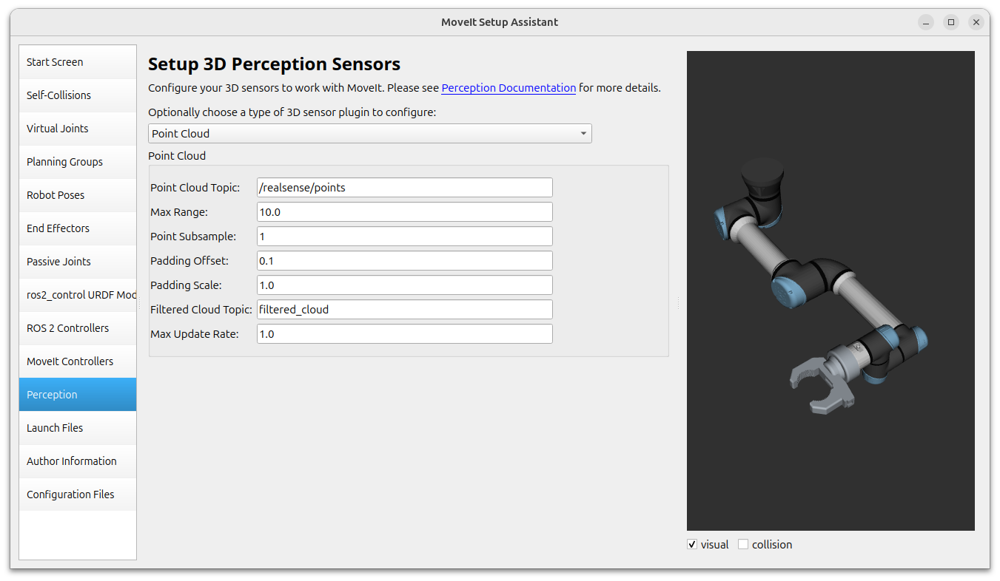
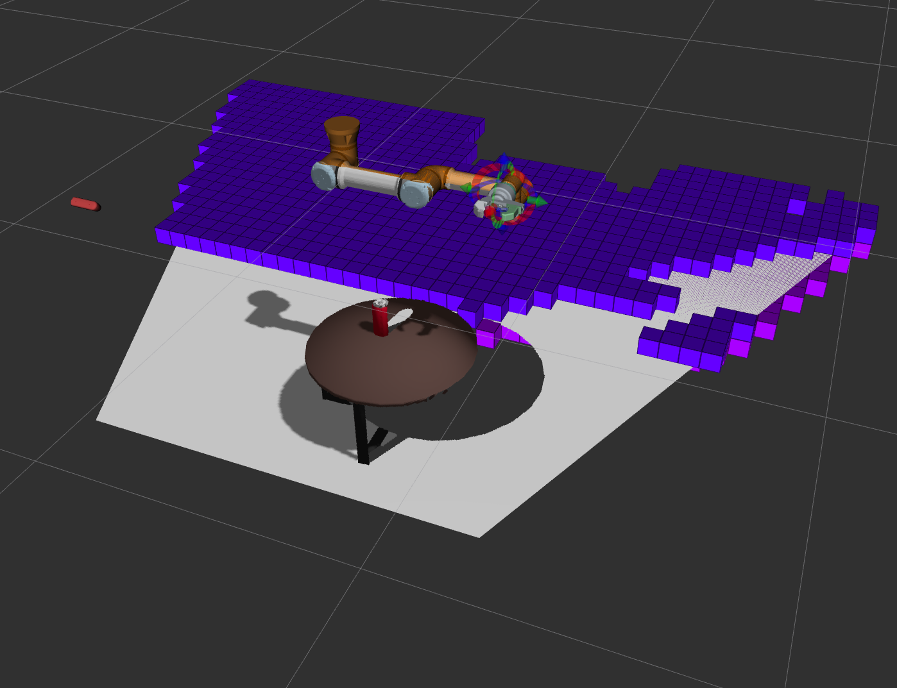
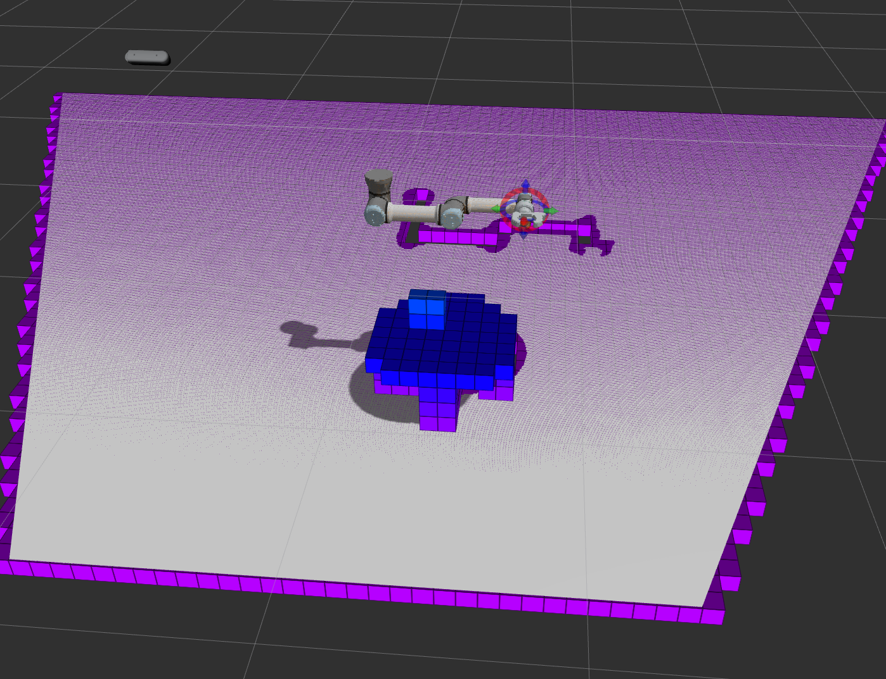

# Day18 - How To Stop Your Robot Arm From Hitting Things - Adding Collision Avoidance Sensors To Your Robot Arm

## Setting up collision avoidance

So far MoveIt has no perception of the surroundings of the robot and therefore the planned trajectories may lead to the robot hitting things and this is not safe. We can configure 3D perception sensors to add collision avoidance to the MoveIt planning in the wizard

To open the MoveIt wizard, execute from `bar_ws`:

 ```bash
$ export QT_QPA_PLATFORM=xcb #force X11
$ ros2 run moveit_setup_assistant moveit_setup_assistant
 ```

On **Load** select the `my_robot_arm_moveit` package.

In the **Perception** tab add a **Point Cloud**, set **Point Cloud Topic** to `/realsense/points` and **Max. Range** to `10.0`.



In **Launch Files** uncheck **Warehouse DB Launch**

(Note: What I did is hitting **Generate_Package** then check all changes made to identify overwritten manual changes that should be kept. Below the conclusions.)

Before hitting **Generate_Package** we should uncheck the following files to avoid overwriting the changes we made manually on Day15:

* `config/joint_limits.yaml`: we don't want to overwrite because we had set `has_acceleration_limits` to `true` and gave `max_acceleration` a value of `1.0`  for all seven joints, and set `max_velocity: 1000.0` for `finger_joint` 
* `launch/move_group.launch.py`: we don't want to overwrite because we had added the line`moveit_config.move_group_capabilities["capabilities"] = ""` 

Also I cancelled changes in:

* `.setup_assistant` because the wizard wanted to remove the following section (?):

```
control_xacro:
    command:
      - position
    state:
      - position
      - velocity
  modified_urdf:
    xacros:
      - control_xacro
  control_xacro:
    command:
      - position
    state:
      - position
      - velocity
```

* `package.xml`: because the Wizard wanted to remove `<exec depend>` tags for gazebo and xacro (?)
* `CMakeLists.txt`: because the Wizard wanted to wrap the install statement in an if clause (why??):

``` 
if(EXISTS "${CMAKE_CURRENT_SOURCE_DIR}/launch")
  install(
    DIRECTORY launch
    DESTINATION share/${PROJECT_NAME}
    PATTERN "setup_assistant.launch" EXCLUDE)
endif()
```

Note: There are three other files with manual changes which were respected by the Wizard:

* in `config/moveit_controllers.yaml` we had added manually two `action_ns: follow_joint_trajectory` lines to both `arm_controller` and `gripper_controller` to resolve the namespace conflict -> the Wizard reformats the file but keeps the change
* in `config/my_robot_arm.srdf` we had added manually a new "Approach" pose -> the wizard reformats but keeps the change

* in `config/my_robot_arm.urdf.xacro` we had commented out the `FakeSystem` ros2 controller -> the wizard made no changes

This is a lot to say that in the end the only significant change was creating one new config file: `sensors_3d.yaml`:

```
sensors:
  - default_sensor
default_sensor:
  filtered_cloud_topic: filtered_cloud
  max_range: 10.0
  max_update_rate: 1.0
  padding_offset: 0.1
  padding_scale: 1.0
  point_cloud_topic: /realsense/points
  point_subsample: 1
  sensor_plugin: occupancy_map_monitor/PointCloudOctomapUpdater
```


Also, it seems that the Realsense camera has a threshold such that will not generate the occupancy map for points closer than about 3m. Therefore I moved the Realsense camera away from the scene. In  `my_robot_arm/urdf/my_robot_arm.urdf.xacro` I modified the following line from 

```xml
...
<origin xyz="0 -1.6 0.6" rpy="0 ${3*pi/4} -${pi/2}" />
...
```

to 

```xml
...
<origin xyz="0 -3.0 1.8" rpy="0 ${3*pi/4} -${pi/2}" />
...
```

| Realsense placed too close - coffee table not detected | Realsense placed further away   |
| ------------------------------------------------------ | ------------------------------- |
|                   |  |

With this MoveIt takes into account the occupancy grid and calculates safe trajectories

## Enabling collisions to be able to grip the can

However gripping is a form of collision, so be need to enable collisions in the vicinity of the object we want to grip, otherwise we won't be able to move the robot arm close to it.

We write a python node to spawn a cylinder in the position of the can and enable collisions around it. 

Placing the cylinder is a manual process and RVIZ is very unstable: spawning the cylinder typically requires running the script several times, RVIZ crashes when I try to move the cylinder, and it fails randomly

## Adjusting positions

I moved the coffee table and Coke can so the robot arm can reach more easily and saved their updated poses in the world file `my_robot_arm/urdf/coke_pickup.sdf`:

```xml
 ...
<model name='CoffeeTable'>
 ...
	<pose>0.30071 -0.42917 -0.00012 -9.86897e-08 -1.02448e-07 0.04797</pose>
	...
<model name='Coke'>
...
	<pose>0.22007 -0.35402 0.37324 -3.52441e-09 -8.61074e-09 1.98230</pose>
	...
```

Finally I manually adjusted the approach position of the robot arm to fit the new position of the Coke, then echoed `/joint states` and updated the "Approach" pose definition in `my_robot_arm_moveit/config/my_robot_arm.srdf`.

```bash
$ ros2 topic echo /joint_states
...
---
header:
  stamp:
    sec: 687
    nanosec: 830000000
  frame_id: ''
name:
- ur5_shoulder_pan_joint
- ur5_shoulder_lift_joint
- ur5_elbow_joint
- ur5_wrist_1_joint
- ur5_wrist_2_joint
- ur5_wrist_3_joint
- finger_joint
position:
- -7.790143095874617e-06
- -0.19348331790511233
- -1.7120161252059076
- 1.7368170527816702
- -8.285330796980646e-05
- 0.16884316112353215
- -1.0147517314942283e-13
velocity:
- 5.421010862427522e-19
- 1.2746748101477579e-14
- 9.754350105417586e-14
- -1.0644783665636481e-13
- 4.336808689942018e-19
- -1.2345647507766566e-14
- 1.3552527156068805e-19
effort:
- .nan
- .nan
- .nan
- .nan
- .nan
- .nan
- .nan
---
...
```

To updating the following section in `my_robot_arm_moveit/config/my_robot_arm.srdf`:

```xml
...
<group_state name="Approach" group="arm">
    <joint name="ur5_shoulder_pan_joint" value="0.000000"/>
    <joint name="ur5_shoulder_lift_joint" value="-0.193483"/>
    <joint name="ur5_elbow_joint" value="-1.712016"/>
    <joint name="ur5_wrist_1_joint" value="1.736817"/>
    <joint name="ur5_wrist_2_joint" value="-0.000083"/>
    <joint name="ur5_wrist_3_joint" value="0.168843"/>
</group_state>
...
```

Next steps: 

- [ ] improve the gripper (the gap it too large in Closed position and the can of Coke slips) > Fixed with: created v3 CAD model with bigger radius, replaced .dae mesh files in repo.
- [ ] automate with vision (!!)
